# FeasOJ 业务流程图

本文档包含 FeasOJ 系统所有核心模块的业务流程图，使用 Mermaid 格式绘制。

## 目录

1. [系统整体架构](#1-系统整体架构)
2. [用户认证流程](#2-用户认证流程)
3. [题目管理流程](#3-题目管理流程)
4. [提交判题流程](#4-提交判题流程)
5. [竞赛管理流程](#5-竞赛管理流程)
6. [班级管理流程](#6-班级管理流程)
7. [讨论区流程](#7-讨论区流程)
8. [管理员流程](#8-管理员流程)

---

## 1. 系统整体架构

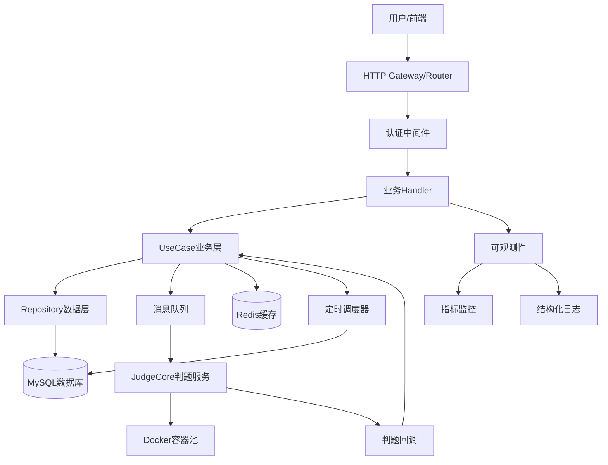
```mermaid
graph TB
    User[用户/前端] --> Gateway[HTTP Gateway/Router]
    Gateway --> Auth[认证中间件]
    Auth --> Handler[业务Handler]
    Handler --> UseCase[UseCase业务层]
    UseCase --> Repo[Repository数据层]
    Repo --> DB[(MySQL数据库)]
    
    UseCase --> Queue[消息队列]
    Queue --> JudgeCore[JudgeCore判题服务]
    JudgeCore --> Docker[Docker容器池]
    JudgeCore --> Callback[判题回调]
    Callback --> UseCase
    
    UseCase --> Cache[(Redis缓存)]
    UseCase --> Scheduler[定时调度器]
    Scheduler --> DB
    
    Handler --> Observability[可观测性]
    Observability --> Metrics[指标监控]
    Observability --> Logs[结构化日志]
```

---

## 2. 用户认证流程

### 2.1 用户注册流程

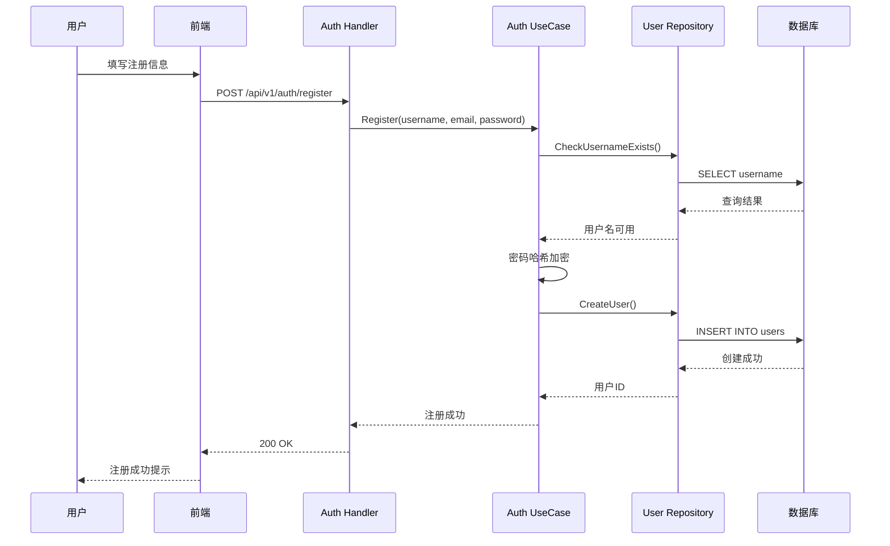
```mermaid
sequenceDiagram
    participant User as 用户
    participant Frontend as 前端
    participant AuthHandler as Auth Handler
    participant AuthUseCase as Auth UseCase
    participant UserRepo as User Repository
    participant DB as 数据库
    
    User->>Frontend: 填写注册信息
    Frontend->>AuthHandler: POST /api/v1/auth/register
    AuthHandler->>AuthUseCase: Register(username, email, password)
    AuthUseCase->>UserRepo: CheckUsernameExists()
    UserRepo->>DB: SELECT username
    DB-->>UserRepo: 查询结果
    UserRepo-->>AuthUseCase: 用户名可用
    AuthUseCase->>AuthUseCase: 密码哈希加密
    AuthUseCase->>UserRepo: CreateUser()
    UserRepo->>DB: INSERT INTO users
    DB-->>UserRepo: 创建成功
    UserRepo-->>AuthUseCase: 用户ID
    AuthUseCase-->>AuthHandler: 注册成功
    AuthHandler-->>Frontend: 200 OK
    Frontend-->>User: 注册成功提示
```

### 2.2 用户登录流程

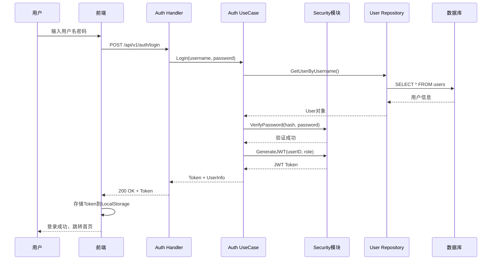
```mermaid
sequenceDiagram
    participant User as 用户
    participant Frontend as 前端
    participant AuthHandler as Auth Handler
    participant AuthUseCase as Auth UseCase
    participant Security as Security模块
    participant UserRepo as User Repository
    participant DB as 数据库
    
    User->>Frontend: 输入用户名密码
    Frontend->>AuthHandler: POST /api/v1/auth/login
    AuthHandler->>AuthUseCase: Login(username, password)
    AuthUseCase->>UserRepo: GetUserByUsername()
    UserRepo->>DB: SELECT * FROM users
    DB-->>UserRepo: 用户信息
    UserRepo-->>AuthUseCase: User对象
    AuthUseCase->>Security: VerifyPassword(hash, password)
    Security-->>AuthUseCase: 验证成功
    AuthUseCase->>Security: GenerateJWT(userID, role)
    Security-->>AuthUseCase: JWT Token
    AuthUseCase-->>AuthHandler: Token + UserInfo
    AuthHandler-->>Frontend: 200 OK + Token
    Frontend->>Frontend: 存储Token到LocalStorage
    Frontend-->>User: 登录成功，跳转首页
```

---

## 3. 题目管理流程

### 3.1 教师创建题目流程

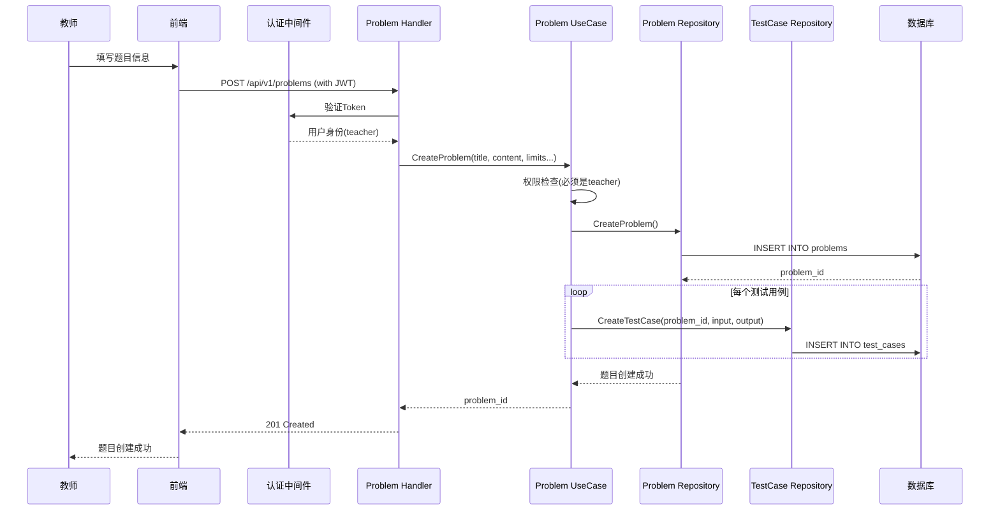
```mermaid
sequenceDiagram
    participant Teacher as 教师
    participant Frontend as 前端
    participant AuthMiddleware as 认证中间件
    participant ProblemHandler as Problem Handler
    participant ProblemUseCase as Problem UseCase
    participant ProblemRepo as Problem Repository
    participant TestCaseRepo as TestCase Repository
    participant DB as 数据库
    
    Teacher->>Frontend: 填写题目信息
    Frontend->>ProblemHandler: POST /api/v1/problems (with JWT)
    ProblemHandler->>AuthMiddleware: 验证Token
    AuthMiddleware-->>ProblemHandler: 用户身份(teacher)
    ProblemHandler->>ProblemUseCase: CreateProblem(title, content, limits...)
    ProblemUseCase->>ProblemUseCase: 权限检查(必须是teacher)
    ProblemUseCase->>ProblemRepo: CreateProblem()
    ProblemRepo->>DB: INSERT INTO problems
    DB-->>ProblemRepo: problem_id
    
    loop 每个测试用例
        ProblemUseCase->>TestCaseRepo: CreateTestCase(problem_id, input, output)
        TestCaseRepo->>DB: INSERT INTO test_cases
    end
    
    ProblemRepo-->>ProblemUseCase: 题目创建成功
    ProblemUseCase-->>ProblemHandler: problem_id
    ProblemHandler-->>Frontend: 201 Created
    Frontend-->>Teacher: 题目创建成功
```

### 3.2 学生查看题目流程

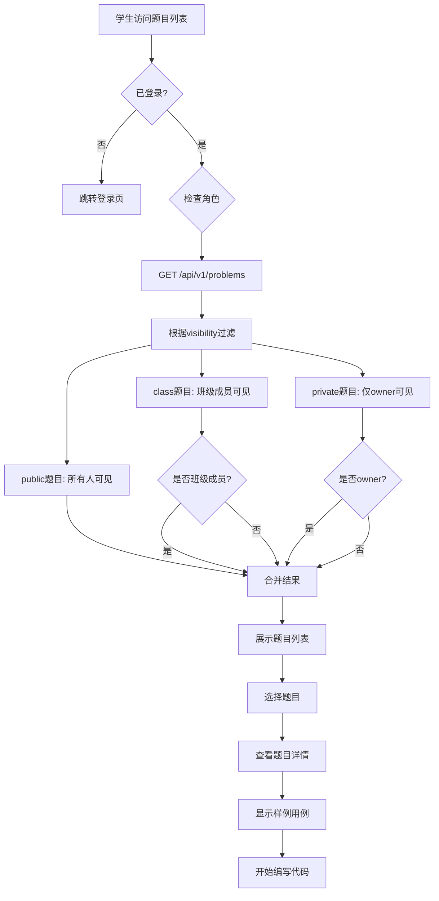
```mermaid
flowchart TD
    Start[学生访问题目列表] --> Auth{已登录?}
    Auth -->|否| Login[跳转登录页]
    Auth -->|是| CheckRole{检查角色}
    
    CheckRole --> GetList[GET /api/v1/problems]
    GetList --> Filter[根据visibility过滤]
    
    Filter --> Public[public题目: 所有人可见]
    Filter --> Class[class题目: 班级成员可见]
    Filter --> Private[private题目: 仅owner可见]
    
    Public --> Merge[合并结果]
    Class --> CheckMembership{是否班级成员?}
    CheckMembership -->|是| Merge
    CheckMembership -->|否| Merge
    Private --> CheckOwner{是否owner?}
    CheckOwner -->|是| Merge
    CheckOwner -->|否| Merge
    
    Merge --> Display[展示题目列表]
    Display --> SelectProblem[选择题目]
    SelectProblem --> ViewDetail[查看题目详情]
    ViewDetail --> ShowSamples[显示样例用例]
    ShowSamples --> End[开始编写代码]
```

---

## 4. 提交判题流程

### 4.1 完整提交判题流程

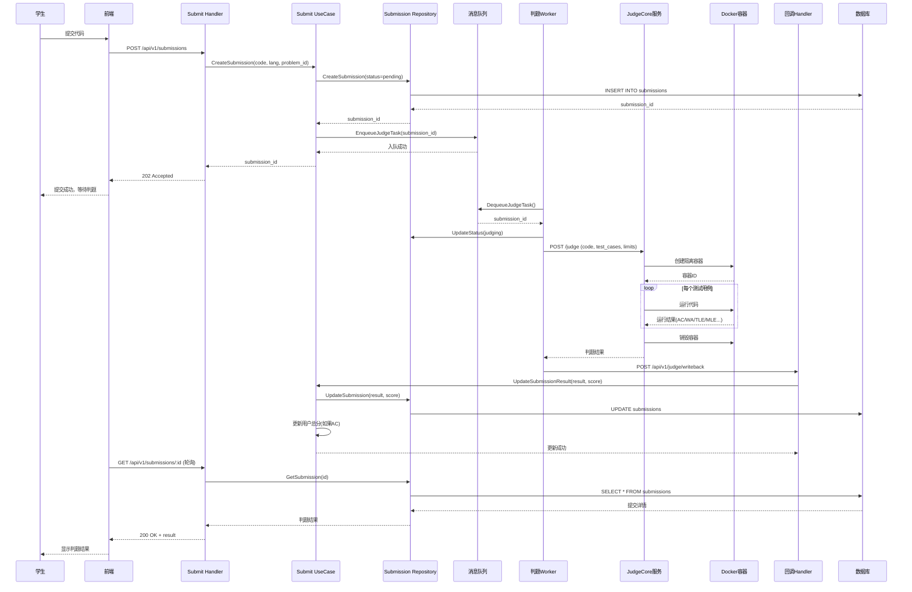
```mermaid
sequenceDiagram
    participant Student as 学生
    participant Frontend as 前端
    participant SubmitHandler as Submit Handler
    participant SubmitUseCase as Submit UseCase
    participant SubmitRepo as Submission Repository
    participant Queue as 消息队列
    participant Worker as 判题Worker
    participant JudgeCore as JudgeCore服务
    participant Docker as Docker容器
    participant Callback as 回调Handler
    participant DB as 数据库
    
    Student->>Frontend: 提交代码
    Frontend->>SubmitHandler: POST /api/v1/submissions
    SubmitHandler->>SubmitUseCase: CreateSubmission(code, lang, problem_id)
    SubmitUseCase->>SubmitRepo: CreateSubmission(status=pending)
    SubmitRepo->>DB: INSERT INTO submissions
    DB-->>SubmitRepo: submission_id
    SubmitRepo-->>SubmitUseCase: submission_id
    
    SubmitUseCase->>Queue: EnqueueJudgeTask(submission_id)
    Queue-->>SubmitUseCase: 入队成功
    SubmitUseCase-->>SubmitHandler: submission_id
    SubmitHandler-->>Frontend: 202 Accepted
    Frontend-->>Student: 提交成功，等待判题
    
    Worker->>Queue: DequeueJudgeTask()
    Queue-->>Worker: submission_id
    Worker->>SubmitRepo: UpdateStatus(judging)
    Worker->>JudgeCore: POST /judge (code, test_cases, limits)
    
    JudgeCore->>Docker: 创建隔离容器
    Docker-->>JudgeCore: 容器ID
    
    loop 每个测试用例
        JudgeCore->>Docker: 运行代码
        Docker-->>JudgeCore: 运行结果(AC/WA/TLE/MLE...)
    end
    
    JudgeCore->>Docker: 销毁容器
    JudgeCore-->>Worker: 判题结果
    
    Worker->>Callback: POST /api/v1/judge/writeback
    Callback->>SubmitUseCase: UpdateSubmissionResult(result, score)
    SubmitUseCase->>SubmitRepo: UpdateSubmission(result, score)
    SubmitRepo->>DB: UPDATE submissions
    SubmitUseCase->>SubmitUseCase: 更新用户总分(如果AC)
    SubmitUseCase-->>Callback: 更新成功
    
    Frontend->>SubmitHandler: GET /api/v1/submissions/:id (轮询)
    SubmitHandler->>SubmitRepo: GetSubmission(id)
    SubmitRepo->>DB: SELECT * FROM submissions
    DB-->>SubmitRepo: 提交详情
    SubmitRepo-->>SubmitHandler: 判题结果
    SubmitHandler-->>Frontend: 200 OK + result
    Frontend-->>Student: 显示判题结果
```

### 4.2 判题状态机

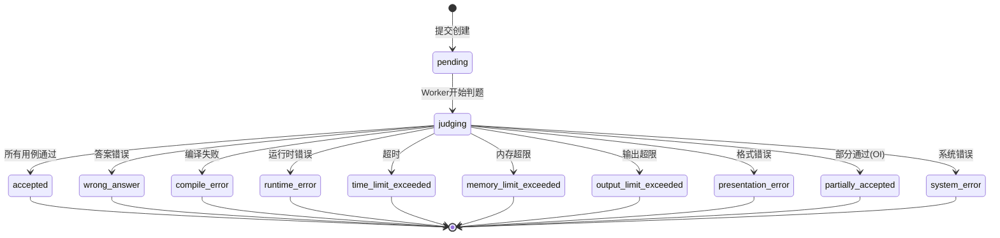
```mermaid
stateDiagram-v2
    [*] --> pending: 提交创建
    pending --> judging: Worker开始判题
    judging --> accepted: 所有用例通过
    judging --> wrong_answer: 答案错误
    judging --> compile_error: 编译失败
    judging --> runtime_error: 运行时错误
    judging --> time_limit_exceeded: 超时
    judging --> memory_limit_exceeded: 内存超限
    judging --> output_limit_exceeded: 输出超限
    judging --> presentation_error: 格式错误
    judging --> partially_accepted: 部分通过(OI)
    judging --> system_error: 系统错误
    
    accepted --> [*]
    wrong_answer --> [*]
    compile_error --> [*]
    runtime_error --> [*]
    time_limit_exceeded --> [*]
    memory_limit_exceeded --> [*]
    output_limit_exceeded --> [*]
    presentation_error --> [*]
    partially_accepted --> [*]
    system_error --> [*]
```

---

## 5. 竞赛管理流程

### 5.1 竞赛创建与状态驱动流程

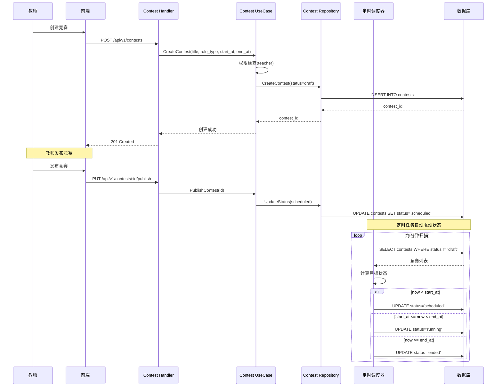
```mermaid
sequenceDiagram
    participant Teacher as 教师
    participant Frontend as 前端
    participant ContestHandler as Contest Handler
    participant ContestUseCase as Contest UseCase
    participant ContestRepo as Contest Repository
    participant Scheduler as 定时调度器
    participant DB as 数据库
    
    Teacher->>Frontend: 创建竞赛
    Frontend->>ContestHandler: POST /api/v1/contests
    ContestHandler->>ContestUseCase: CreateContest(title, rule_type, start_at, end_at)
    ContestUseCase->>ContestUseCase: 权限检查(teacher)
    ContestUseCase->>ContestRepo: CreateContest(status=draft)
    ContestRepo->>DB: INSERT INTO contests
    DB-->>ContestRepo: contest_id
    ContestRepo-->>ContestUseCase: contest_id
    ContestUseCase-->>ContestHandler: 创建成功
    ContestHandler-->>Frontend: 201 Created
    
    Note over Teacher,Frontend: 教师发布竞赛
    Teacher->>Frontend: 发布竞赛
    Frontend->>ContestHandler: PUT /api/v1/contests/:id/publish
    ContestHandler->>ContestUseCase: PublishContest(id)
    ContestUseCase->>ContestRepo: UpdateStatus(scheduled)
    ContestRepo->>DB: UPDATE contests SET status='scheduled'
    
    Note over Scheduler,DB: 定时任务自动驱动状态
    loop 每分钟扫描
        Scheduler->>DB: SELECT contests WHERE status != 'draft'
        DB-->>Scheduler: 竞赛列表
        Scheduler->>Scheduler: 计算目标状态
        alt now < start_at
            Scheduler->>DB: UPDATE status='scheduled'
        else start_at <= now < end_at
            Scheduler->>DB: UPDATE status='running'
        else now >= end_at
            Scheduler->>DB: UPDATE status='ended'
        end
    end
```

### 5.2 学生参加竞赛流程

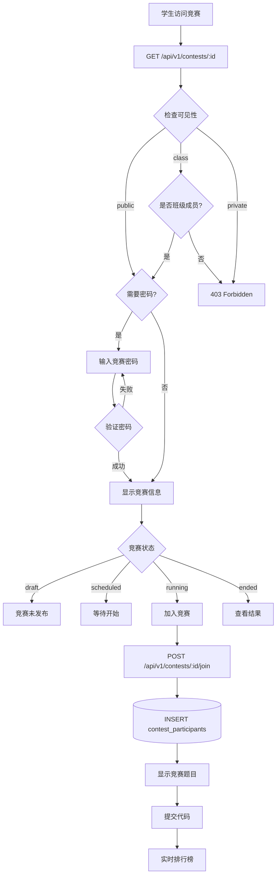
```mermaid
flowchart TD
    Start[学生访问竞赛] --> GetContest[GET /api/v1/contests/:id]
    GetContest --> CheckVisibility{检查可见性}
    
    CheckVisibility -->|public| CheckEncrypted{需要密码?}
    CheckVisibility -->|class| CheckClassMember{是否班级成员?}
    CheckVisibility -->|private| Forbidden[403 Forbidden]
    
    CheckClassMember -->|是| CheckEncrypted
    CheckClassMember -->|否| Forbidden
    
    CheckEncrypted -->|是| InputPassword[输入竞赛密码]
    CheckEncrypted -->|否| ShowContest[显示竞赛信息]
    
    InputPassword --> VerifyPassword{验证密码}
    VerifyPassword -->|失败| InputPassword
    VerifyPassword -->|成功| ShowContest
    
    ShowContest --> CheckStatus{竞赛状态}
    CheckStatus -->|draft| NotStarted[竞赛未发布]
    CheckStatus -->|scheduled| Waiting[等待开始]
    CheckStatus -->|running| Join[加入竞赛]
    CheckStatus -->|ended| ViewResult[查看结果]
    
    Join --> CreateParticipant[POST /api/v1/contests/:id/join]
    CreateParticipant --> InsertDB[(INSERT contest_participants)]
    InsertDB --> ShowProblems[显示竞赛题目]
    ShowProblems --> Submit[提交代码]
    Submit --> Scoreboard[实时排行榜]
```

### 5.3 ACM排行榜计算流程

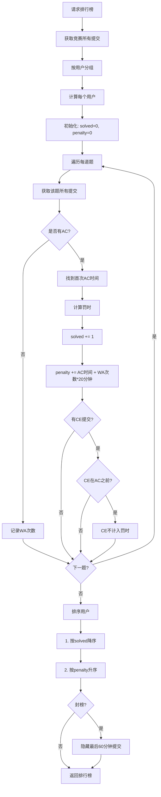
```mermaid
flowchart TD
    Start[请求排行榜] --> GetSubmissions[获取竞赛所有提交]
    GetSubmissions --> GroupByUser[按用户分组]
    
    GroupByUser --> CalculateUser[计算每个用户]
    CalculateUser --> InitScore[初始化: solved=0, penalty=0]
    
    InitScore --> LoopProblems[遍历每道题]
    LoopProblems --> GetProblemSubmits[获取该题所有提交]
    
    GetProblemSubmits --> CheckAC{是否有AC?}
    CheckAC -->|否| CountWA[记录WA次数]
    CheckAC -->|是| FindFirstAC[找到首次AC时间]
    
    CountWA --> NextProblem{下一题?}
    
    FindFirstAC --> CalcPenalty[计算罚时]
    CalcPenalty --> AddSolved[solved += 1]
    AddSolved --> AddPenalty[penalty += AC时间 + WA次数*20分钟]
    AddPenalty --> CheckCE{有CE提交?}
    
    CheckCE -->|是| CheckCEBeforeAC{CE在AC之前?}
    CheckCE -->|否| NextProblem
    
    CheckCEBeforeAC -->|是| IgnoreCE[CE不计入罚时]
    CheckCEBeforeAC -->|否| NextProblem
    
    IgnoreCE --> NextProblem
    NextProblem -->|是| LoopProblems
    NextProblem -->|否| SortUsers[排序用户]
    
    SortUsers --> SortBySolved[1. 按solved降序]
    SortBySolved --> SortByPenalty[2. 按penalty升序]
    SortByPenalty --> ApplyFreeze{封榜?}
    
    ApplyFreeze -->|是| HideLastHour[隐藏最后60分钟提交]
    ApplyFreeze -->|否| ReturnResult[返回排行榜]
    HideLastHour --> ReturnResult
```

---

## 6. 班级管理流程

### 6.1 教师创建班级流程

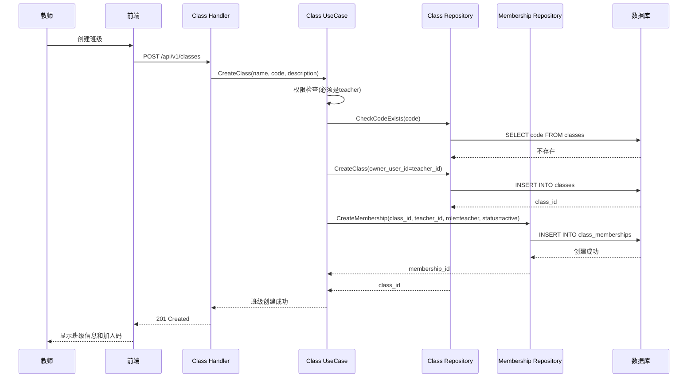
```mermaid
sequenceDiagram
    participant Teacher as 教师
    participant Frontend as 前端
    participant ClassHandler as Class Handler
    participant ClassUseCase as Class UseCase
    participant ClassRepo as Class Repository
    participant MembershipRepo as Membership Repository
    participant DB as 数据库
    
    Teacher->>Frontend: 创建班级
    Frontend->>ClassHandler: POST /api/v1/classes
    ClassHandler->>ClassUseCase: CreateClass(name, code, description)
    ClassUseCase->>ClassUseCase: 权限检查(必须是teacher)
    ClassUseCase->>ClassRepo: CheckCodeExists(code)
    ClassRepo->>DB: SELECT code FROM classes
    DB-->>ClassRepo: 不存在
    
    ClassUseCase->>ClassRepo: CreateClass(owner_user_id=teacher_id)
    ClassRepo->>DB: INSERT INTO classes
    DB-->>ClassRepo: class_id
    
    ClassUseCase->>MembershipRepo: CreateMembership(class_id, teacher_id, role=teacher, status=active)
    MembershipRepo->>DB: INSERT INTO class_memberships
    DB-->>MembershipRepo: 创建成功
    
    MembershipRepo-->>ClassUseCase: membership_id
    ClassRepo-->>ClassUseCase: class_id
    ClassUseCase-->>ClassHandler: 班级创建成功
    ClassHandler-->>Frontend: 201 Created
    Frontend-->>Teacher: 显示班级信息和加入码
```

### 6.2 学生申请加入班级流程

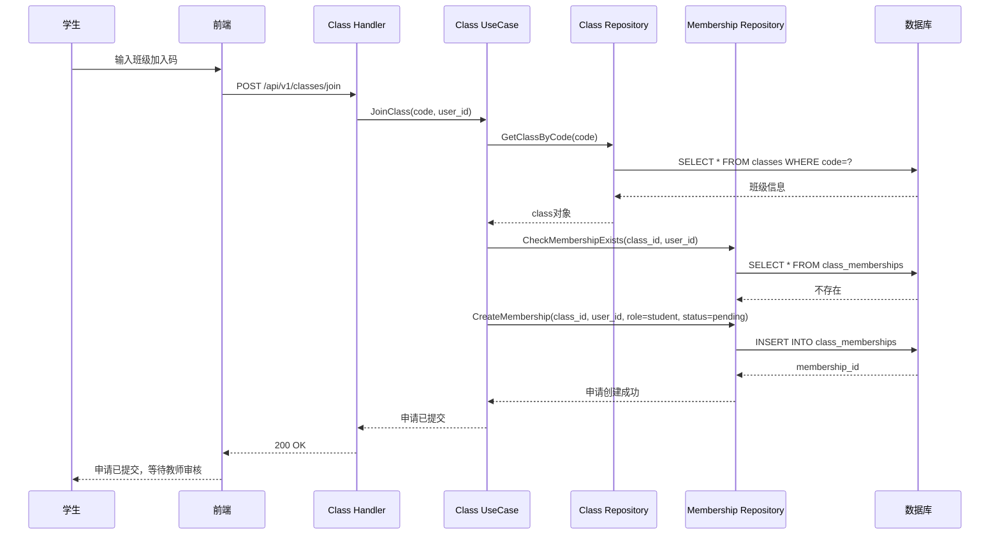
```mermaid
sequenceDiagram
    participant Student as 学生
    participant Frontend as 前端
    participant ClassHandler as Class Handler
    participant ClassUseCase as Class UseCase
    participant ClassRepo as Class Repository
    participant MembershipRepo as Membership Repository
    participant DB as 数据库
    
    Student->>Frontend: 输入班级加入码
    Frontend->>ClassHandler: POST /api/v1/classes/join
    ClassHandler->>ClassUseCase: JoinClass(code, user_id)
    
    ClassUseCase->>ClassRepo: GetClassByCode(code)
    ClassRepo->>DB: SELECT * FROM classes WHERE code=?
    DB-->>ClassRepo: 班级信息
    ClassRepo-->>ClassUseCase: class对象
    
    ClassUseCase->>MembershipRepo: CheckMembershipExists(class_id, user_id)
    MembershipRepo->>DB: SELECT * FROM class_memberships
    DB-->>MembershipRepo: 不存在
    
    ClassUseCase->>MembershipRepo: CreateMembership(class_id, user_id, role=student, status=pending)
    MembershipRepo->>DB: INSERT INTO class_memberships
    DB-->>MembershipRepo: membership_id
    
    MembershipRepo-->>ClassUseCase: 申请创建成功
    ClassUseCase-->>ClassHandler: 申请已提交
    ClassHandler-->>Frontend: 200 OK
    Frontend-->>Student: 申请已提交，等待教师审核
```

### 6.3 教师审核学生申请流程

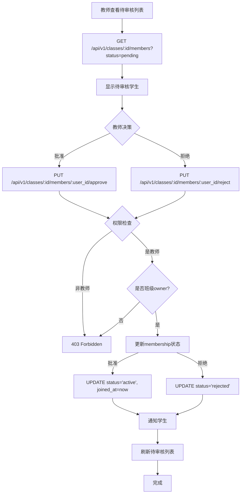
```mermaid
flowchart TD
    Start[教师查看待审核列表] --> GetPending[GET /api/v1/classes/:id/members?status=pending]
    GetPending --> ShowList[显示待审核学生]
    
    ShowList --> TeacherDecision{教师决策}
    
    TeacherDecision -->|批准| Approve[PUT /api/v1/classes/:id/members/:user_id/approve]
    TeacherDecision -->|拒绝| Reject[PUT /api/v1/classes/:id/members/:user_id/reject]
    
    Approve --> CheckAuth{权限检查}
    Reject --> CheckAuth
    
    CheckAuth -->|非教师| Forbidden[403 Forbidden]
    CheckAuth -->|是教师| CheckOwner{是否班级owner?}
    
    CheckOwner -->|否| Forbidden
    CheckOwner -->|是| UpdateStatus[更新membership状态]
    
    UpdateStatus -->|批准| SetActive[UPDATE status='active', joined_at=now]
    UpdateStatus -->|拒绝| SetRejected[UPDATE status='rejected']
    
    SetActive --> NotifyStudent[通知学生]
    SetRejected --> NotifyStudent
    
    NotifyStudent --> RefreshList[刷新待审核列表]
    RefreshList --> End[完成]
```

### 6.4 班级成员状态机

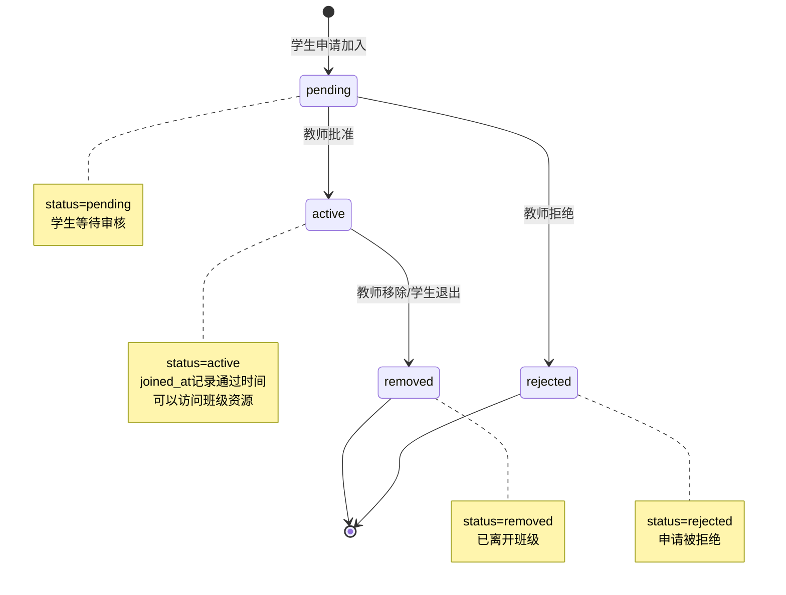
```mermaid
stateDiagram-v2
    [*] --> pending: 学生申请加入
    pending --> active: 教师批准
    pending --> rejected: 教师拒绝
    active --> removed: 教师移除/学生退出
    
    rejected --> [*]
    removed --> [*]
    
    note right of pending
        status=pending
        学生等待审核
    end note
    
    note right of active
        status=active
        joined_at记录通过时间
        可以访问班级资源
    end note
    
    note right of rejected
        status=rejected
        申请被拒绝
    end note
    
    note right of removed
        status=removed
        已离开班级
    end note
```

---

## 7. 讨论区流程

### 7.1 发帖与评论流程

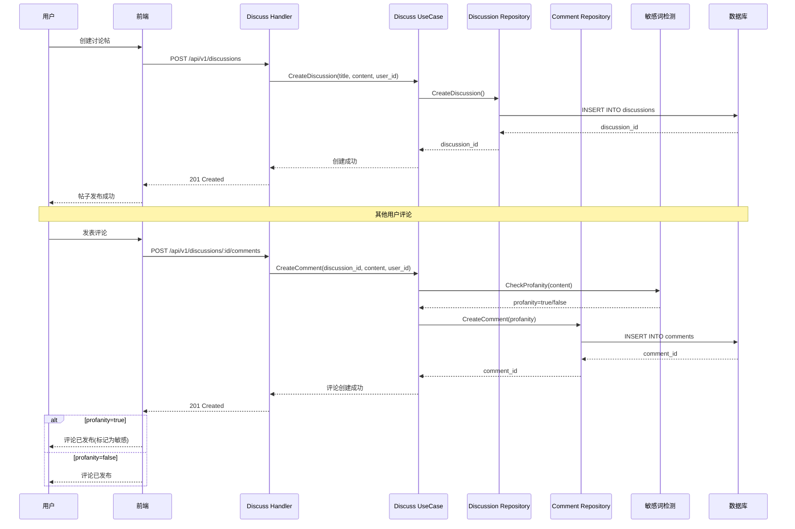
```mermaid
sequenceDiagram
    participant User as 用户
    participant Frontend as 前端
    participant DiscussHandler as Discuss Handler
    participant DiscussUseCase as Discuss UseCase
    participant DiscussRepo as Discussion Repository
    participant CommentRepo as Comment Repository
    participant ProfanityDetector as 敏感词检测
    participant DB as 数据库
    
    User->>Frontend: 创建讨论帖
    Frontend->>DiscussHandler: POST /api/v1/discussions
    DiscussHandler->>DiscussUseCase: CreateDiscussion(title, content, user_id)
    DiscussUseCase->>DiscussRepo: CreateDiscussion()
    DiscussRepo->>DB: INSERT INTO discussions
    DB-->>DiscussRepo: discussion_id
    DiscussRepo-->>DiscussUseCase: discussion_id
    DiscussUseCase-->>DiscussHandler: 创建成功
    DiscussHandler-->>Frontend: 201 Created
    Frontend-->>User: 帖子发布成功
    
    Note over User,DB: 其他用户评论
    User->>Frontend: 发表评论
    Frontend->>DiscussHandler: POST /api/v1/discussions/:id/comments
    DiscussHandler->>DiscussUseCase: CreateComment(discussion_id, content, user_id)
    
    DiscussUseCase->>ProfanityDetector: CheckProfanity(content)
    ProfanityDetector-->>DiscussUseCase: profanity=true/false
    
    DiscussUseCase->>CommentRepo: CreateComment(profanity)
    CommentRepo->>DB: INSERT INTO comments
    DB-->>CommentRepo: comment_id
    CommentRepo-->>DiscussUseCase: comment_id
    DiscussUseCase-->>DiscussHandler: 评论创建成功
    DiscussHandler-->>Frontend: 201 Created
    
    alt profanity=true
        Frontend-->>User: 评论已发布(标记为敏感)
    else profanity=false
        Frontend-->>User: 评论已发布
    end
```

### 7.2 讨论区浏览流程

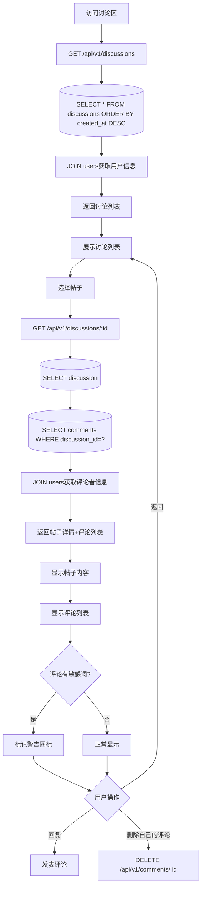
```mermaid
flowchart TD
    Start[访问讨论区] --> GetList[GET /api/v1/discussions]
    GetList --> QueryDB[(SELECT * FROM discussions ORDER BY created_at DESC)]
    QueryDB --> JoinUser[JOIN users获取用户信息]
    JoinUser --> ReturnList[返回讨论列表]
    
    ReturnList --> Display[展示讨论列表]
    Display --> SelectPost[选择帖子]
    SelectPost --> GetDetail[GET /api/v1/discussions/:id]
    
    GetDetail --> QueryPost[(SELECT discussion)]
    QueryPost --> QueryComments[(SELECT comments WHERE discussion_id=?)]
    QueryComments --> JoinCommentUser[JOIN users获取评论者信息]
    JoinCommentUser --> ReturnDetail[返回帖子详情+评论列表]
    
    ReturnDetail --> ShowPost[显示帖子内容]
    ShowPost --> ShowComments[显示评论列表]
    ShowComments --> CheckProfanity{评论有敏感词?}
    
    CheckProfanity -->|是| MarkWarning[标记警告图标]
    CheckProfanity -->|否| NormalDisplay[正常显示]
    
    MarkWarning --> UserAction{用户操作}
    NormalDisplay --> UserAction
    
    UserAction -->|回复| CreateComment[发表评论]
    UserAction -->|删除自己的评论| DeleteComment[DELETE /api/v1/comments/:id]
    UserAction -->|返回| Display
```

---

## 8. 管理员流程

### 8.1 管理员创建教师账号流程

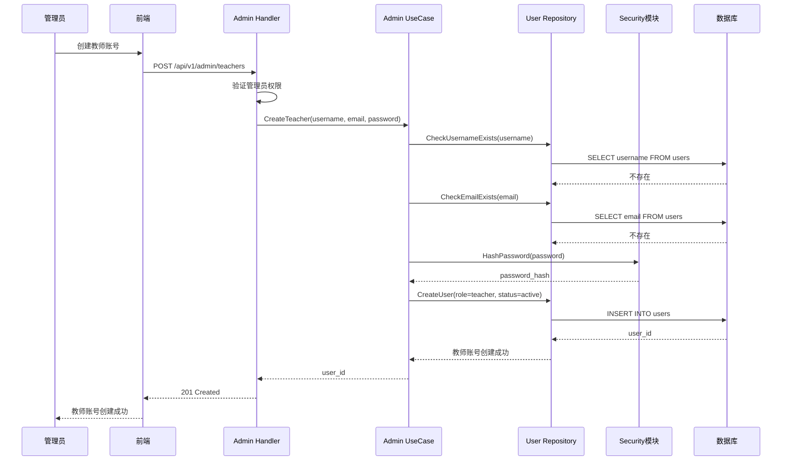
```mermaid
sequenceDiagram
    participant Admin as 管理员
    participant Frontend as 前端
    participant AdminHandler as Admin Handler
    participant AdminUseCase as Admin UseCase
    participant UserRepo as User Repository
    participant Security as Security模块
    participant DB as 数据库
    
    Admin->>Frontend: 创建教师账号
    Frontend->>AdminHandler: POST /api/v1/admin/teachers
    AdminHandler->>AdminHandler: 验证管理员权限
    AdminHandler->>AdminUseCase: CreateTeacher(username, email, password)
    
    AdminUseCase->>UserRepo: CheckUsernameExists(username)
    UserRepo->>DB: SELECT username FROM users
    DB-->>UserRepo: 不存在
    
    AdminUseCase->>UserRepo: CheckEmailExists(email)
    UserRepo->>DB: SELECT email FROM users
    DB-->>UserRepo: 不存在
    
    AdminUseCase->>Security: HashPassword(password)
    Security-->>AdminUseCase: password_hash
    
    AdminUseCase->>UserRepo: CreateUser(role=teacher, status=active)
    UserRepo->>DB: INSERT INTO users
    DB-->>UserRepo: user_id
    
    UserRepo-->>AdminUseCase: 教师账号创建成功
    AdminUseCase-->>AdminHandler: user_id
    AdminHandler-->>Frontend: 201 Created
    Frontend-->>Admin: 教师账号创建成功
```

### 8.2 管理员用户管理流程

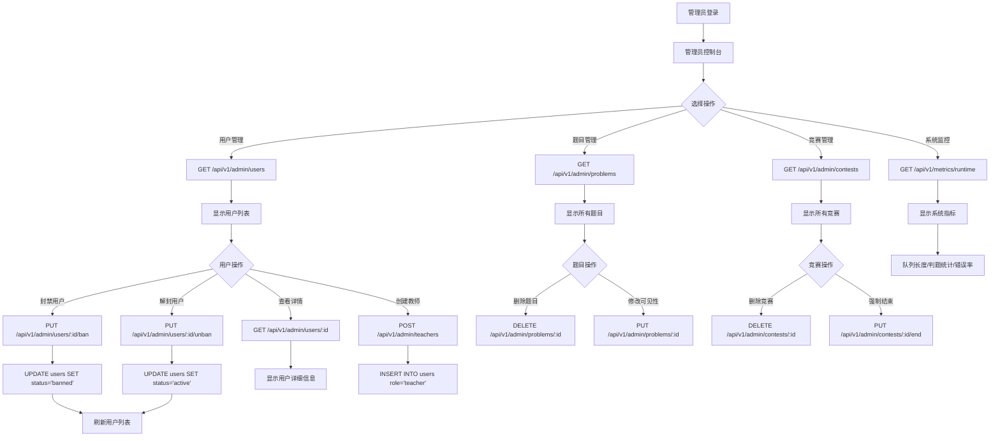
```mermaid
flowchart TD
    Start[管理员登录] --> Dashboard[管理员控制台]
    Dashboard --> SelectAction{选择操作}
    
    SelectAction -->|用户管理| UserMgmt[GET /api/v1/admin/users]
    SelectAction -->|题目管理| ProblemMgmt[GET /api/v1/admin/problems]
    SelectAction -->|竞赛管理| ContestMgmt[GET /api/v1/admin/contests]
    SelectAction -->|系统监控| Monitoring[GET /api/v1/metrics/runtime]
    
    UserMgmt --> ListUsers[显示用户列表]
    ListUsers --> UserAction{用户操作}
    
    UserAction -->|查看详情| ViewUser[GET /api/v1/admin/users/:id]
    UserAction -->|封禁用户| BanUser[PUT /api/v1/admin/users/:id/ban]
    UserAction -->|解封用户| UnbanUser[PUT /api/v1/admin/users/:id/unban]
    UserAction -->|创建教师| CreateTeacher[POST /api/v1/admin/teachers]
    
    BanUser --> UpdateStatus[UPDATE users SET status='banned']
    UnbanUser --> UpdateStatus2[UPDATE users SET status='active']
    
    UpdateStatus --> RefreshList[刷新用户列表]
    UpdateStatus2 --> RefreshList
    ViewUser --> ShowDetail[显示用户详细信息]
    CreateTeacher --> InsertTeacher[INSERT INTO users role='teacher']
    
    ProblemMgmt --> ListProblems[显示所有题目]
    ListProblems --> ProblemAction{题目操作}
    ProblemAction -->|删除题目| DeleteProblem[DELETE /api/v1/admin/problems/:id]
    ProblemAction -->|修改可见性| UpdateVisibility[PUT /api/v1/admin/problems/:id]
    
    ContestMgmt --> ListContests[显示所有竞赛]
    ListContests --> ContestAction{竞赛操作}
    ContestAction -->|删除竞赛| DeleteContest[DELETE /api/v1/admin/contests/:id]
    ContestAction -->|强制结束| ForceEnd[PUT /api/v1/admin/contests/:id/end]
    
    Monitoring --> ShowMetrics[显示系统指标]
    ShowMetrics --> MetricsDetail[队列长度/判题统计/错误率]
```

---

## 9. 数据模型关系图

### 9.1 核心实体关系

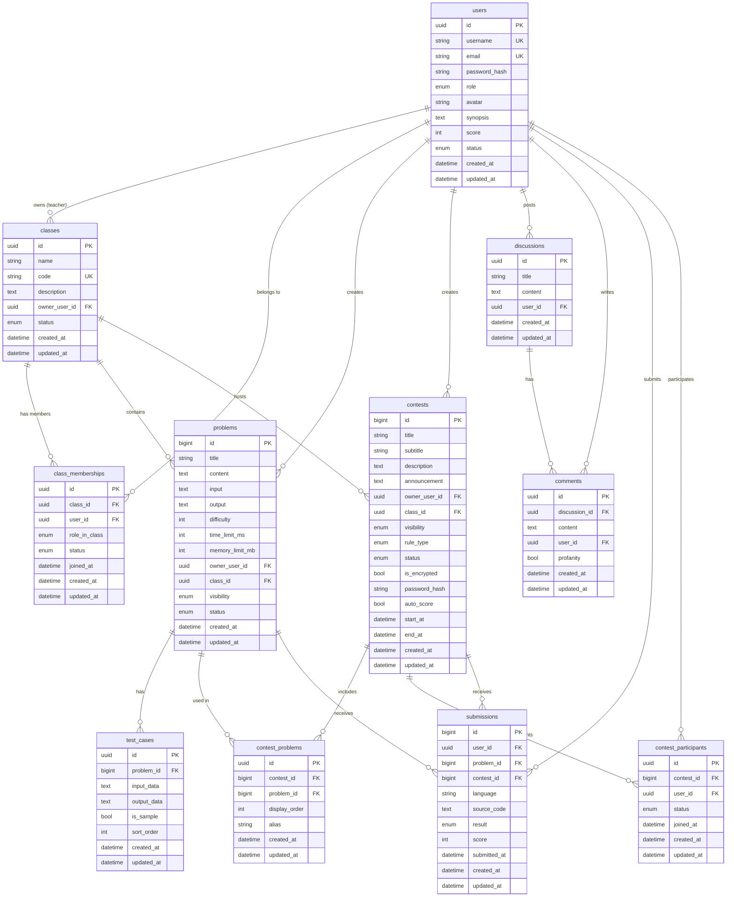
```mermaid
erDiagram
    users ||--o{ classes : "owns (teacher)"
    users ||--o{ class_memberships : "belongs to"
    users ||--o{ problems : "creates"
    users ||--o{ contests : "creates"
    users ||--o{ discussions : "posts"
    users ||--o{ comments : "writes"
    users ||--o{ submissions : "submits"
    users ||--o{ contest_participants : "participates"
    
    classes ||--o{ class_memberships : "has members"
    classes ||--o{ problems : "contains"
    classes ||--o{ contests : "hosts"
    
    problems ||--o{ test_cases : "has"
    problems ||--o{ contest_problems : "used in"
    problems ||--o{ submissions : "receives"
    
    contests ||--o{ contest_problems : "includes"
    contests ||--o{ contest_participants : "has participants"
    contests ||--o{ submissions : "receives"
    
    discussions ||--o{ comments : "has"
    
    users {
        uuid id PK
        string username UK
        string email UK
        string password_hash
        enum role
        string avatar
        text synopsis
        int score
        enum status
        datetime created_at
        datetime updated_at
    }
    
    classes {
        uuid id PK
        string name
        string code UK
        text description
        uuid owner_user_id FK
        enum status
        datetime created_at
        datetime updated_at
    }
    
    class_memberships {
        uuid id PK
        uuid class_id FK
        uuid user_id FK
        enum role_in_class
        enum status
        datetime joined_at
        datetime created_at
        datetime updated_at
    }
    
    problems {
        bigint id PK
        string title
        text content
        text input
        text output
        int difficulty
        int time_limit_ms
        int memory_limit_mb
        uuid owner_user_id FK
        uuid class_id FK
        enum visibility
        enum status
        datetime created_at
        datetime updated_at
    }
    
    test_cases {
        uuid id PK
        bigint problem_id FK
        text input_data
        text output_data
        bool is_sample
        int sort_order
        datetime created_at
        datetime updated_at
    }
    
    contests {
        bigint id PK
        string title
        string subtitle
        text description
        text announcement
        uuid owner_user_id FK
        uuid class_id FK
        enum visibility
        enum rule_type
        enum status
        bool is_encrypted
        string password_hash
        bool auto_score
        datetime start_at
        datetime end_at
        datetime created_at
        datetime updated_at
    }
    
    contest_problems {
        uuid id PK
        bigint contest_id FK
        bigint problem_id FK
        int display_order
        string alias
        datetime created_at
        datetime updated_at
    }
    
    contest_participants {
        uuid id PK
        bigint contest_id FK
        uuid user_id FK
        enum status
        datetime joined_at
        datetime created_at
        datetime updated_at
    }
    
    submissions {
        bigint id PK
        uuid user_id FK
        bigint problem_id FK
        bigint contest_id FK
        string language
        text source_code
        enum result
        int score
        datetime submitted_at
        datetime created_at
        datetime updated_at
    }
    
    discussions {
        uuid id PK
        string title
        text content
        uuid user_id FK
        datetime created_at
        datetime updated_at
    }
    
    comments {
        uuid id PK
        uuid discussion_id FK
        text content
        uuid user_id FK
        bool profanity
        datetime created_at
        datetime updated_at
    }
```

---

## 10. 系统架构分层图

### 10.1 后端架构分层

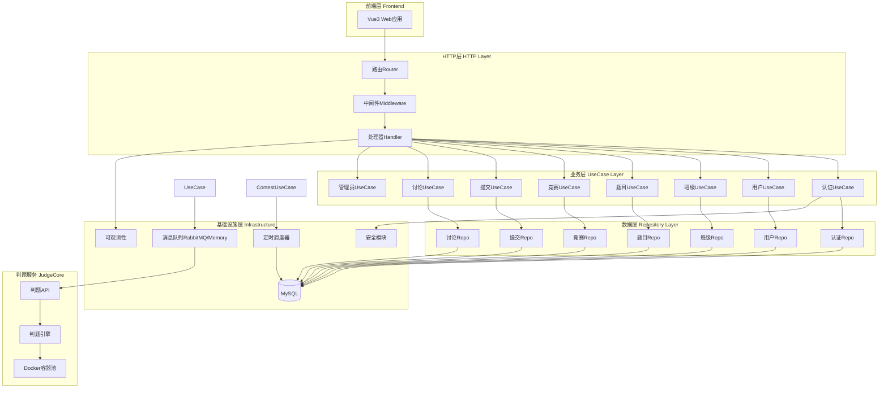
```mermaid
graph TB
    subgraph "前端层 Frontend"
        Web[Vue3 Web应用]
    end
    
    subgraph "HTTP层 HTTP Layer"
        Router[路由Router]
        Middleware[中间件Middleware]
        Handler[处理器Handler]
    end
    
    subgraph "业务层 UseCase Layer"
        AuthUC[认证UseCase]
        UserUC[用户UseCase]
        ClassUC[班级UseCase]
        ProblemUC[题目UseCase]
        ContestUC[竞赛UseCase]
        SubmitUC[提交UseCase]
        DiscussUC[讨论UseCase]
        AdminUC[管理员UseCase]
    end
    
    subgraph "数据层 Repository Layer"
        AuthRepo[认证Repo]
        UserRepo[用户Repo]
        ClassRepo[班级Repo]
        ProblemRepo[题目Repo]
        ContestRepo[竞赛Repo]
        SubmitRepo[提交Repo]
        DiscussRepo[讨论Repo]
    end
    
    subgraph "基础设施层 Infrastructure"
        DB[(MySQL)]
        Queue[消息队列RabbitMQ/Memory]
        Scheduler[定时调度器]
        Security[安全模块]
        Observability[可观测性]
    end
    
    subgraph "判题服务 JudgeCore"
        JudgeAPI[判题API]
        JudgeEngine[判题引擎]
        DockerPool[Docker容器池]
    end
    
    Web --> Router
    Router --> Middleware
    Middleware --> Handler
    
    Handler --> AuthUC
    Handler --> UserUC
    Handler --> ClassUC
    Handler --> ProblemUC
    Handler --> ContestUC
    Handler --> SubmitUC
    Handler --> DiscussUC
    Handler --> AdminUC
    
    AuthUC --> AuthRepo
    UserUC --> UserRepo
    ClassUC --> ClassRepo
    ProblemUC --> ProblemRepo
    ContestUC --> ContestRepo
    SubmitUC --> SubmitRepo
    DiscussUC --> DiscussRepo
    
    AuthRepo --> DB
    UserRepo --> DB
    ClassRepo --> DB
    ProblemRepo --> DB
    ContestRepo --> DB
    SubmitRepo --> DB
    DiscussRepo --> DB
    
    UseCase --> Queue
    Queue --> JudgeAPI
    JudgeAPI --> JudgeEngine
    JudgeEngine --> DockerPool
    
    ContestUseCase --> Scheduler
    Scheduler --> DB
    
    AuthUC --> Security
    Handler --> Observability
```

---

## 11. 权限控制流程

### 11.1 权限验证流程

```mermaid
flowchart TD
    Start[HTTP请求] --> ExtractToken[提取JWT Token]
    ExtractToken --> ValidateToken{Token有效?}
    
    ValidateToken -->|无效| Return401[401 Unauthorized]
    ValidateToken -->|有效| ParseClaims[解析Token Claims]
    
    ParseClaims --> GetUserInfo[获取用户信息]
    GetUserInfo --> CheckStatus{用户状态}
    
    CheckStatus -->|banned| Return403[403 Forbidden - 用户已封禁]
    CheckStatus -->|active| CheckRole{检查角色}
    
    CheckRole --> CheckResource{检查资源权限}
    
    CheckResource -->|公共资源| AllowAccess[允许访问]
    CheckResource -->|需要登录| CheckLogin{已登录?}
    CheckResource -->|需要教师权限| CheckTeacher{role=teacher?}
    CheckResource -->|需要管理员权限| CheckAdmin{role=admin?}
    CheckResource -->|需要资源所有权| CheckOwnership{是否owner?}
    CheckResource -->|需要班级成员| CheckClassMember{是否班级成员?}
    
    CheckLogin -->|否| Return401
    CheckLogin -->|是| AllowAccess
    
    CheckTeacher -->|否| Return403
    CheckTeacher -->|是| AllowAccess
    
    CheckAdmin -->|否| Return403
    CheckAdmin -->|是| AllowAccess
    
    CheckOwnership -->|否| Return403
    CheckOwnership -->|是| AllowAccess
    
    CheckClassMember -->|否| Return403
    CheckClassMember -->|是| AllowAccess
    
    AllowAccess --> ExecuteHandler[执行业务逻辑]
    ExecuteHandler --> Return200[200 OK]
```

### 11.2 资源可见性权限矩阵

```mermaid
graph TD
    subgraph "题目可见性 Problem Visibility"
        P1[public题目] --> PA[所有登录用户可见]
        P2[class题目] --> PB[班级成员 + owner可见]
        P3[private题目] --> PC[仅owner可见]
    end
    
    subgraph "竞赛可见性 Contest Visibility"
        C1[public竞赛] --> CA[所有登录用户可见]
        C2[class竞赛] --> CB[班级成员 + owner可见]
        C3[private竞赛] --> CC[仅owner可见]
        C4[加密竞赛] --> CD[需要密码验证]
    end
    
    subgraph "班级权限 Class Permissions"
        CL1[创建班级] --> CLA[仅teacher角色]
        CL2[审核成员] --> CLB[班级owner]
        CL3[查看成员] --> CLC[班级成员 + owner]
        CL4[申请加入] --> CLD[所有student]
    end
    
    subgraph "管理员权限 Admin Permissions"
        A1[创建教师] --> AA[仅admin角色]
        A2[封禁用户] --> AB[仅admin角色]
        A3[删除资源] --> AC[仅admin角色]
        A4[查看所有数据] --> AD[仅admin角色]
    end
```

---

## 12. 队列与异步处理流程

### 12.1 消息队列架构

```mermaid
graph TB
    subgraph "生产者 Producers"
        SubmitHandler[提交Handler]
    end
    
    subgraph "消息队列 Message Queue"
        QueueInterface[队列接口]
        RabbitMQ[RabbitMQ实现]
        MemoryQueue[内存队列实现]
        
        QueueInterface --> RabbitMQ
        QueueInterface --> MemoryQueue
    end
    
    subgraph "消费者 Consumers"
        Worker1[判题Worker-1]
        Worker2[判题Worker-2]
        WorkerN[判题Worker-N]
    end
    
    subgraph "判题服务 JudgeCore"
        JudgeAPI[判题API]
    end
    
    subgraph "回调 Callback"
        WritebackHandler[回写Handler]
        SubmitRepo[提交Repository]
    end
    
    SubmitHandler -->|EnqueueJudgeTask| QueueInterface
    
    QueueInterface -->|DequeueJudgeTask| Worker1
    QueueInterface -->|DequeueJudgeTask| Worker2
    QueueInterface -->|DequeueJudgeTask| WorkerN
    
    Worker1 -->|POST /judge| JudgeAPI
    Worker2 -->|POST /judge| JudgeAPI
    WorkerN -->|POST /judge| JudgeAPI
    
    JudgeAPI -->|判题完成| Worker1
    JudgeAPI -->|判题完成| Worker2
    JudgeAPI -->|判题完成| WorkerN
    
    Worker1 -->|POST /api/v1/judge/writeback| WritebackHandler
    Worker2 -->|POST /api/v1/judge/writeback| WritebackHandler
    WorkerN -->|POST /api/v1/judge/writeback| WritebackHandler
    
    WritebackHandler --> SubmitRepo
    SubmitRepo -->|UPDATE submissions| DB[(数据库)]
```

### 12.2 判题Worker生命周期

```mermaid
stateDiagram-v2
    [*] --> Idle: Worker启动
    Idle --> Polling: 轮询队列
    Polling --> Idle: 队列为空
    Polling --> Processing: 获取任务
    
    Processing --> FetchSubmission: 获取提交详情
    FetchSubmission --> UpdateStatus: 更新状态为judging
    UpdateStatus --> CallJudgeCore: 调用JudgeCore
    
    CallJudgeCore --> WaitResult: 等待判题结果
    WaitResult --> Writeback: 收到结果
    
    Writeback --> UpdateDB: 更新数据库
    UpdateDB --> Success: 更新成功
    UpdateDB --> Retry: 更新失败
    
    Retry --> Writeback: 重试(最多3次)
    Retry --> Failed: 超过重试次数
    
    Success --> Idle: 继续处理下一个
    Failed --> LogError: 记录错误日志
    LogError --> Idle: 继续处理下一个
    
    note right of Processing
        从队列获取submission_id
    end note
    
    note right of CallJudgeCore
        POST /judge
        传递代码、测试用例、限制
    end note
    
    note right of Writeback
        POST /api/v1/judge/writeback
        幂等性保证
    end note
```

---

## 13. 定时调度流程

### 13.1 竞赛状态自动驱动

```mermaid
sequenceDiagram
    participant Scheduler as 定时调度器
    participant DB as 数据库
    participant ContestRepo as Contest Repository
    participant Logger as 日志系统
    
    Note over Scheduler: 每分钟执行一次
    
    loop 每分钟
        Scheduler->>DB: SELECT * FROM contests WHERE status != 'draft'
        DB-->>Scheduler: 竞赛列表
        
        loop 遍历每个竞赛
            Scheduler->>Scheduler: 计算目标状态
            
            alt now < start_at
                Scheduler->>Scheduler: desired_status = 'scheduled'
            else start_at <= now < end_at
                Scheduler->>Scheduler: desired_status = 'running'
            else now >= end_at
                Scheduler->>Scheduler: desired_status = 'ended'
            end
            
            Scheduler->>DB: SELECT status FROM contests WHERE id=?
            DB-->>Scheduler: current_status
            
            alt current_status != desired_status
                Scheduler->>ContestRepo: UpdateStatus(id, desired_status)
                ContestRepo->>DB: UPDATE contests SET status=?
                DB-->>ContestRepo: 更新成功
                ContestRepo-->>Scheduler: 状态已更新
                Scheduler->>Logger: 记录状态变更日志
            else current_status == desired_status
                Scheduler->>Scheduler: 无需更新，跳过
            end
        end
    end
```

---

## 14. 可观测性与监控

### 14.1 监控指标收集流程

```mermaid
graph TB
    subgraph "业务层 Business Layer"
        Handler[HTTP Handler]
        UseCase[UseCase]
        Worker[判题Worker]
    end
    
    subgraph "可观测性模块 Observability"
        Metrics[指标收集器]
        Logger[结构化日志]
        Counter[计数器]
        Timer[计时器]
    end
    
    subgraph "指标类型 Metrics Types"
        QueueLen[队列长度]
        SubmitCount[提交总数]
        JudgeSuccess[判题成功数]
        JudgeFail[判题失败数]
        APILatency[API延迟]
        ErrorRate[错误率]
    end
    
    subgraph "日志类型 Log Types"
        AccessLog[访问日志]
        ErrorLog[错误日志]
        BusinessLog[业务日志]
        AuditLog[审计日志]
    end
    
    Handler --> Metrics
    UseCase --> Metrics
    Worker --> Metrics
    
    Handler --> Logger
    UseCase --> Logger
    Worker --> Logger
    
    Metrics --> Counter
    Metrics --> Timer
    
    Counter --> QueueLen
    Counter --> SubmitCount
    Counter --> JudgeSuccess
    Counter --> JudgeFail
    
    Timer --> APILatency
    
    Logger --> AccessLog
    Logger --> ErrorLog
    Logger --> BusinessLog
    Logger --> AuditLog
    
    QueueLen --> Endpoint[GET /api/v1/metrics/runtime]
    SubmitCount --> Endpoint
    JudgeSuccess --> Endpoint
    JudgeFail --> Endpoint
    APILatency --> Endpoint
    ErrorRate --> Endpoint
```

---

## 15. 前端页面流程

### 15.1 前端路由与页面结构

```mermaid
graph TB
    Home[首页 /] --> Login{已登录?}
    
    Login -->|否| LoginPage[登录页 /login]
    Login -->|是| Dashboard[用户控制台]
    
    LoginPage --> Register[注册页 /register]
    
    Dashboard --> Problems[题目列表 /problems]
    Dashboard --> Contests[竞赛列表 /contests]
    Dashboard --> Discuss[讨论区 /discuss]
    Dashboard --> Profile[个人中心 /profile]
    Dashboard --> Classes[班级管理 /classes]
    
    Problems --> ProblemDetail[题目详情 /problems/:id]
    ProblemDetail --> CodeEditor[代码编辑器]
    CodeEditor --> Submit[提交代码]
    Submit --> SubmitResult[查看结果 /submissions/:id]
    
    Contests --> ContestDetail[竞赛详情 /contests/:id]
    ContestDetail --> ContestProblems[竞赛题目列表]
    ContestProblems --> ContestProblemDetail[题目详情]
    ContestDetail --> Scoreboard[排行榜 /contests/:id/scoreboard]
    
    Discuss --> DiscussDetail[帖子详情 /discuss/:id]
    DiscussDetail --> PostComment[发表评论]
    
    Profile --> EditProfile[编辑资料]
    Profile --> MySubmissions[我的提交]
    Profile --> MyContests[我的竞赛]
    
    Classes --> ClassDetail[班级详情 /classes/:id]
    ClassDetail --> ClassMembers[班级成员]
    ClassDetail --> ClassProblems[班级题目]
    ClassDetail --> ClassContests[班级竞赛]
    
    Dashboard --> AdminPanel{管理员?}
    AdminPanel -->|是| AdminDashboard[管理员控制台 /admin]
    AdminDashboard --> UserManagement[用户管理]
    AdminDashboard --> ProblemManagement[题目管理]
    AdminDashboard --> ContestManagement[竞赛管理]
    AdminDashboard --> SystemMonitoring[系统监控]
```

---

## 16. 错误处理流程

### 16.1 统一错误处理

```mermaid
flowchart TD
    Start[业务逻辑执行] --> TryCatch{捕获异常?}
    
    TryCatch -->|无异常| Success[返回成功响应]
    TryCatch -->|有异常| ClassifyError{错误分类}
    
    ClassifyError -->|ValidationError| Return400[400 Bad Request]
    ClassifyError -->|AuthenticationError| Return401[401 Unauthorized]
    ClassifyError -->|AuthorizationError| Return403[403 Forbidden]
    ClassifyError -->|NotFoundError| Return404[404 Not Found]
    ClassifyError -->|ConflictError| Return409[409 Conflict]
    ClassifyError -->|RateLimitError| Return429[429 Too Many Requests]
    ClassifyError -->|InternalError| Return500[500 Internal Server Error]
    
    Return400 --> LogError[记录错误日志]
    Return401 --> LogError
    Return403 --> LogError
    Return404 --> LogError
    Return409 --> LogError
    Return429 --> LogError
    Return500 --> LogError
    
    LogError --> FormatResponse[格式化错误响应]
    FormatResponse --> ReturnJSON[返回JSON错误]
    
    ReturnJSON --> Frontend[前端接收]
    Frontend --> ShowError[显示错误提示]
    
    Success --> ReturnData[返回数据]
    ReturnData --> Frontend
    Frontend --> ShowSuccess[显示成功状态]
```

---

## 17. 总结

本文档涵盖了 FeasOJ 系统的所有核心业务流程，包括：

- **系统架构**：整体架构、分层设计、模块划分
- **用户管理**：注册、登录、权限控制
- **题目管理**：创建、查看、权限控制
- **判题系统**：提交、队列、异步判题、状态机
- **竞赛系统**：创建、状态驱动、参与、排行榜
- **班级系统**：创建、申请、审核、成员管理
- **讨论区**：发帖、评论、敏感词检测
- **管理员**：用户管理、资源管理、系统监控
- **基础设施**：队列、调度、可观测性、错误处理

所有流程图使用 Mermaid 格式，可在支持 Mermaid 的 Markdown 渲染器中直接查看。

---

**文档版本**: v1.0  
**创建日期**: 2026-04-20  
**最后更新**: 2026-04-20

