# FeasOJ 业务流程图 (修正版)

> 本文档基于实际代码结构绘制，准确反映backend-rebuild的架构设计

## 目录

1. [系统整体架构](#1-系统整体架构)
2. [用户认证流程](#2-用户认证流程)
3. [题目管理流程](#3-题目管理流程)
4. [提交判题流程](#4-提交判题流程)
5. [竞赛管理流程](#5-竞赛管理流程)
6. [班级管理流程](#6-班级管理流程)
7. [讨论区流程](#7-讨论区流程)
8. [管理员流程](#8-管理员流程)

---

## 1. 系统整体架构

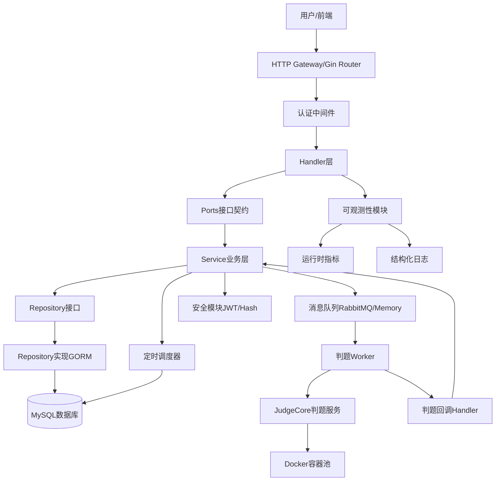
```mermaid
graph TB
    User[用户/前端] --> Gateway[HTTP Gateway/Gin Router]
    Gateway --> Middleware[认证中间件]
    Middleware --> Handler[Handler层]
    Handler --> Ports[Ports接口契约]
    Ports --> Service[Service业务层]
    Service --> RepoInterface[Repository接口]
    RepoInterface --> RepoImpl[Repository实现GORM]
    RepoImpl --> DB[(MySQL数据库)]
    
    Service --> Queue[消息队列RabbitMQ/Memory]
    Queue --> Worker[判题Worker]
    Worker --> JudgeCore[JudgeCore判题服务]
    JudgeCore --> Docker[Docker容器池]
    Worker --> Callback[判题回调Handler]
    Callback --> Service
    
    Service --> Scheduler[定时调度器]
    Scheduler --> DB
    
    Handler --> Observability[可观测性模块]
    Observability --> Metrics[运行时指标]
    Observability --> Logs[结构化日志]
    
    Service --> Security[安全模块JWT/Hash]
```

---

## 2. 用户认证流程

### 2.1 用户注册流程

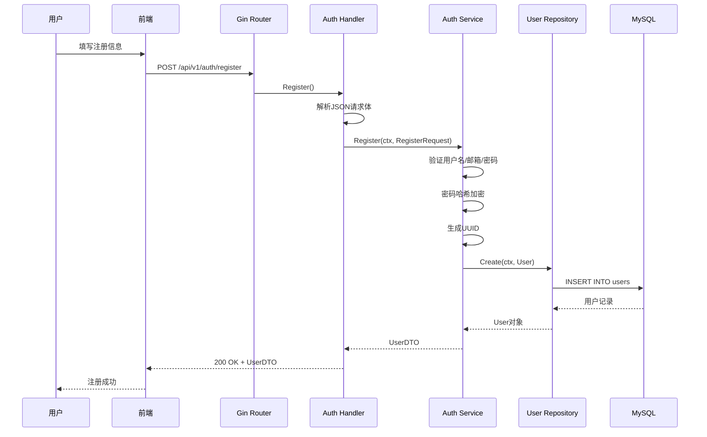
```mermaid
sequenceDiagram
    participant User as 用户
    participant Frontend as 前端
    participant Router as Gin Router
    participant Handler as Auth Handler
    participant Service as Auth Service
    participant Repo as User Repository
    participant DB as MySQL
    
    User->>Frontend: 填写注册信息
    Frontend->>Router: POST /api/v1/auth/register
    Router->>Handler: Register()
    Handler->>Handler: 解析JSON请求体
    Handler->>Service: Register(ctx, RegisterRequest)
    
    Service->>Service: 验证用户名/邮箱/密码
    Service->>Service: 密码哈希加密
    Service->>Service: 生成UUID
    Service->>Repo: Create(ctx, User)
    Repo->>DB: INSERT INTO users
    DB-->>Repo: 用户记录
    Repo-->>Service: User对象
    Service-->>Handler: UserDTO
    Handler-->>Frontend: 200 OK + UserDTO
    Frontend-->>User: 注册成功
```

### 2.2 用户登录流程

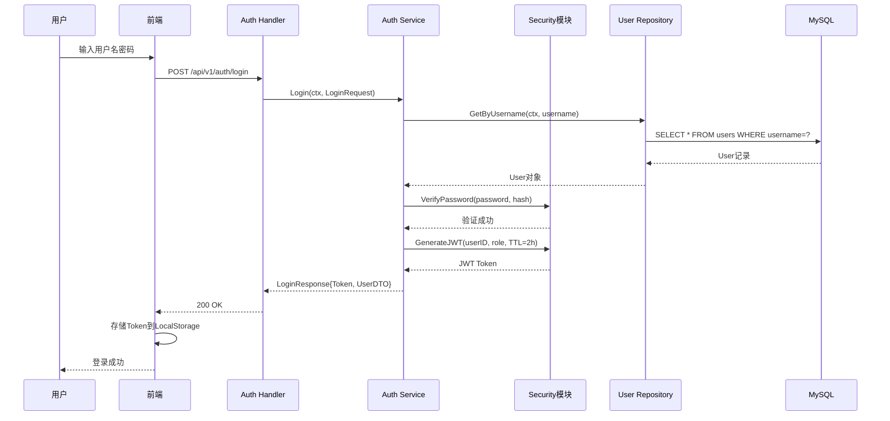
```mermaid
sequenceDiagram
    participant User as 用户
    participant Frontend as 前端
    participant Handler as Auth Handler
    participant Service as Auth Service
    participant Security as Security模块
    participant Repo as User Repository
    participant DB as MySQL
    
    User->>Frontend: 输入用户名密码
    Frontend->>Handler: POST /api/v1/auth/login
    Handler->>Service: Login(ctx, LoginRequest)
    
    Service->>Repo: GetByUsername(ctx, username)
    Repo->>DB: SELECT * FROM users WHERE username=?
    DB-->>Repo: User记录
    Repo-->>Service: User对象
    
    Service->>Security: VerifyPassword(password, hash)
    Security-->>Service: 验证成功
    
    Service->>Security: GenerateJWT(userID, role, TTL=2h)
    Security-->>Service: JWT Token
    
    Service-->>Handler: LoginResponse{Token, UserDTO}
    Handler-->>Frontend: 200 OK
    Frontend->>Frontend: 存储Token到LocalStorage
    Frontend-->>User: 登录成功
```

### 2.3 Token验证流程

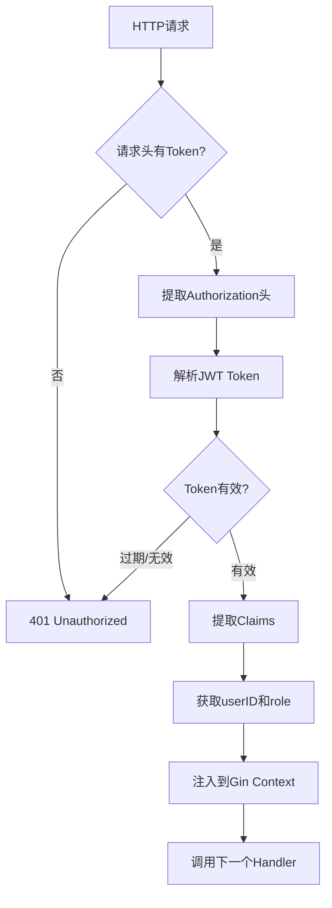
```mermaid
flowchart TD
    Start[HTTP请求] --> HasToken{请求头有Token?}
    HasToken -->|否| Return401[401 Unauthorized]
    HasToken -->|是| ExtractToken[提取Authorization头]
    
    ExtractToken --> ParseJWT[解析JWT Token]
    ParseJWT --> ValidateJWT{Token有效?}
    
    ValidateJWT -->|过期/无效| Return401
    ValidateJWT -->|有效| ExtractClaims[提取Claims]
    
    ExtractClaims --> GetUserInfo[获取userID和role]
    GetUserInfo --> InjectContext[注入到Gin Context]
    InjectContext --> NextHandler[调用下一个Handler]
```

---

## 3. 题目管理流程

### 3.1 教师创建题目流程

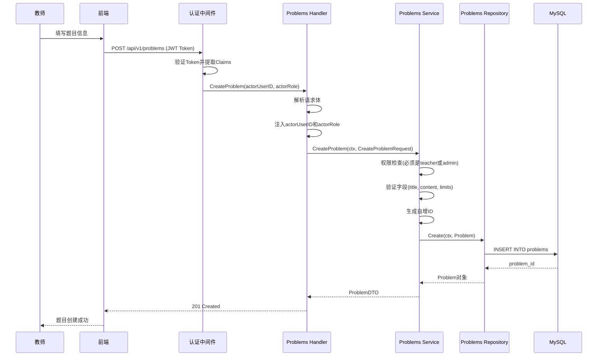
```mermaid
sequenceDiagram
    participant Teacher as 教师
    participant Frontend as 前端
    participant Middleware as 认证中间件
    participant Handler as Problems Handler
    participant Service as Problems Service
    participant Repo as Problems Repository
    participant DB as MySQL
    
    Teacher->>Frontend: 填写题目信息
    Frontend->>Middleware: POST /api/v1/problems (JWT Token)
    Middleware->>Middleware: 验证Token并提取Claims
    Middleware->>Handler: CreateProblem(actorUserID, actorRole)
    
    Handler->>Handler: 解析请求体
    Handler->>Handler: 注入actorUserID和actorRole
    Handler->>Service: CreateProblem(ctx, CreateProblemRequest)
    
    Service->>Service: 权限检查(必须是teacher或admin)
    Service->>Service: 验证字段(title, content, limits)
    Service->>Service: 生成自增ID
    
    Service->>Repo: Create(ctx, Problem)
    Repo->>DB: INSERT INTO problems
    DB-->>Repo: problem_id
    Repo-->>Service: Problem对象
    
    Service-->>Handler: ProblemDTO
    Handler-->>Frontend: 201 Created
    Frontend-->>Teacher: 题目创建成功
```

### 3.2 学生查看题目流程

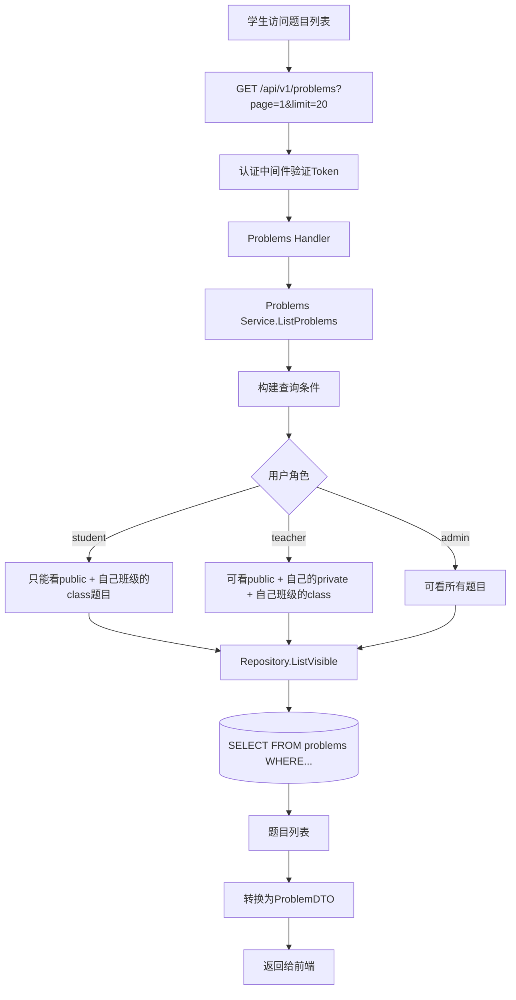
```mermaid
flowchart TD
    Start[学生访问题目列表] --> Request[GET /api/v1/problems?page=1&limit=20]
    Request --> Auth[认证中间件验证Token]
    Auth --> Handler[Problems Handler]
    Handler --> Service[Problems Service.ListProblems]
    
    Service --> BuildQuery[构建查询条件]
    BuildQuery --> CheckRole{用户角色}
    
    CheckRole -->|student| FilterStudent[只能看public + 自己班级的class题目]
    CheckRole -->|teacher| FilterTeacher[可看public + 自己的private + 自己班级的class]
    CheckRole -->|admin| FilterAdmin[可看所有题目]
    
    FilterStudent --> QueryDB[Repository.ListVisible]
    FilterTeacher --> QueryDB
    FilterAdmin --> QueryDB
    
    QueryDB --> DB[(SELECT FROM problems WHERE...)]
    DB --> Results[题目列表]
    Results --> ToDTO[转换为ProblemDTO]
    ToDTO --> Return[返回给前端]
```

---

## 4. 提交判题流程

### 4.1 完整提交判题流程

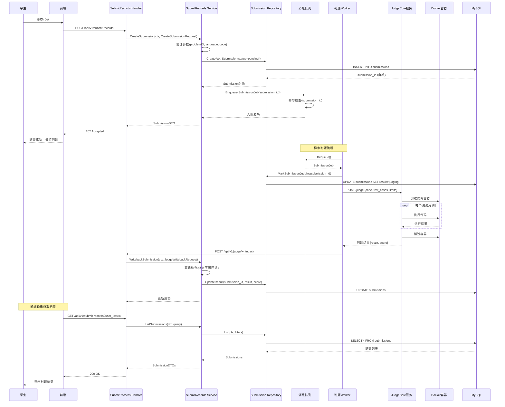
```mermaid
sequenceDiagram
    participant Student as 学生
    participant Frontend as 前端
    participant Handler as SubmitRecords Handler
    participant Service as SubmitRecords Service
    participant Repo as Submission Repository
    participant Queue as 消息队列
    participant Worker as 判题Worker
    participant JudgeCore as JudgeCore服务
    participant Docker as Docker容器
    participant DB as MySQL
    
    Student->>Frontend: 提交代码
    Frontend->>Handler: POST /api/v1/submit-records
    Handler->>Service: CreateSubmission(ctx, CreateSubmissionRequest)
    
    Service->>Service: 验证参数(problemID, language, code)
    Service->>Repo: Create(ctx, Submission{status=pending})
    Repo->>DB: INSERT INTO submissions
    DB-->>Repo: submission_id (自增)
    Repo-->>Service: Submission对象
    
    Service->>Queue: Enqueue(SubmissionJob{submission_id})
    Queue->>Queue: 幂等检查(submission_id)
    Queue-->>Service: 入队成功
    
    Service-->>Handler: SubmissionDTO
    Handler-->>Frontend: 202 Accepted
    Frontend-->>Student: 提交成功，等待判题
    
    Note over Worker,Queue: 异步判题流程
    Worker->>Queue: Dequeue()
    Queue-->>Worker: SubmissionJob
    
    Worker->>Repo: MarkSubmissionJudging(submission_id)
    Repo->>DB: UPDATE submissions SET result='judging'
    
    Worker->>JudgeCore: POST /judge {code, test_cases, limits}
    JudgeCore->>Docker: 创建隔离容器
    
    loop 每个测试用例
        JudgeCore->>Docker: 执行代码
        Docker-->>JudgeCore: 运行结果
    end
    
    JudgeCore->>Docker: 销毁容器
    JudgeCore-->>Worker: 判题结果{result, score}
    
    Worker->>Handler: POST /api/v1/judge/writeback
    Handler->>Service: WritebackSubmission(ctx, JudgeWritebackRequest)
    Service->>Service: 幂等检查(终态不可回退)
    Service->>Repo: UpdateResult(submission_id, result, score)
    Repo->>DB: UPDATE submissions
    Service-->>Handler: 更新成功
    
    Note over Frontend,Student: 前端轮询获取结果
    Frontend->>Handler: GET /api/v1/submit-records?user_id=xxx
    Handler->>Service: ListSubmissions(ctx, query)
    Service->>Repo: List(ctx, filters)
    Repo->>DB: SELECT * FROM submissions
    DB-->>Repo: 提交列表
    Repo-->>Service: Submissions
    Service-->>Handler: SubmissionDTOs
    Handler-->>Frontend: 200 OK
    Frontend-->>Student: 显示判题结果
```

### 4.2 判题状态机

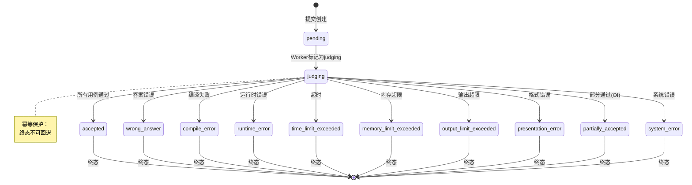
```mermaid
stateDiagram-v2
    [*] --> pending: 提交创建
    pending --> judging: Worker标记为judging
    
    judging --> accepted: 所有用例通过
    judging --> wrong_answer: 答案错误
    judging --> compile_error: 编译失败
    judging --> runtime_error: 运行时错误
    judging --> time_limit_exceeded: 超时
    judging --> memory_limit_exceeded: 内存超限
    judging --> output_limit_exceeded: 输出超限
    judging --> presentation_error: 格式错误
    judging --> partially_accepted: 部分通过(OI)
    judging --> system_error: 系统错误
    
    accepted --> [*]: 终态
    wrong_answer --> [*]: 终态
    compile_error --> [*]: 终态
    runtime_error --> [*]: 终态
    time_limit_exceeded --> [*]: 终态
    memory_limit_exceeded --> [*]: 终态
    output_limit_exceeded --> [*]: 终态
    presentation_error --> [*]: 终态
    partially_accepted --> [*]: 终态
    system_error --> [*]: 终态
    
    note right of judging
        幂等保护：
        终态不可回退
    end note
```

---

## 5. 竞赛管理流程

### 5.1 竞赛创建与状态驱动

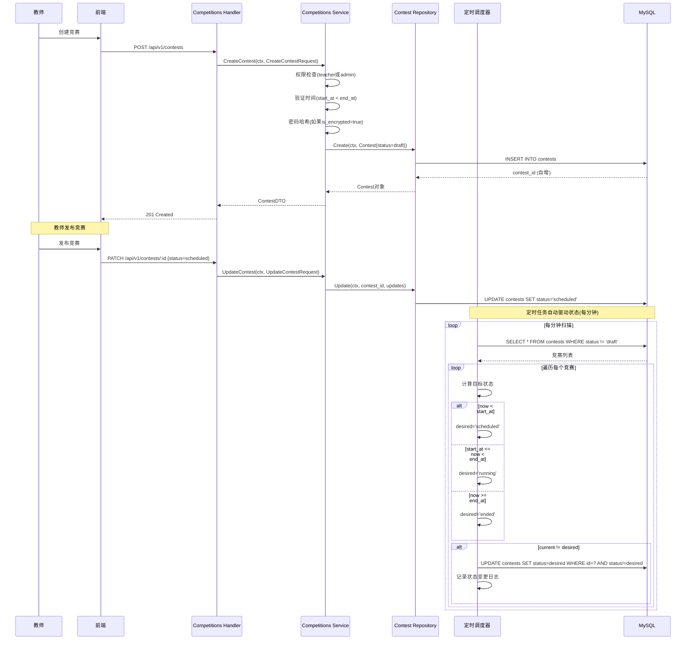
```mermaid
sequenceDiagram
    participant Teacher as 教师
    participant Frontend as 前端
    participant Handler as Competitions Handler
    participant Service as Competitions Service
    participant Repo as Contest Repository
    participant Scheduler as 定时调度器
    participant DB as MySQL
    
    Teacher->>Frontend: 创建竞赛
    Frontend->>Handler: POST /api/v1/contests
    Handler->>Service: CreateContest(ctx, CreateContestRequest)
    
    Service->>Service: 权限检查(teacher或admin)
    Service->>Service: 验证时间(start_at < end_at)
    Service->>Service: 密码哈希(如果is_encrypted=true)
    
    Service->>Repo: Create(ctx, Contest{status=draft})
    Repo->>DB: INSERT INTO contests
    DB-->>Repo: contest_id (自增)
    Repo-->>Service: Contest对象
    Service-->>Handler: ContestDTO
    Handler-->>Frontend: 201 Created
    
    Note over Teacher,Frontend: 教师发布竞赛
    Teacher->>Frontend: 发布竞赛
    Frontend->>Handler: PATCH /api/v1/contests/:id {status=scheduled}
    Handler->>Service: UpdateContest(ctx, UpdateContestRequest)
    Service->>Repo: Update(ctx, contest_id, updates)
    Repo->>DB: UPDATE contests SET status='scheduled'
    
    Note over Scheduler,DB: 定时任务自动驱动状态(每分钟)
    loop 每分钟扫描
        Scheduler->>DB: SELECT * FROM contests WHERE status != 'draft'
        DB-->>Scheduler: 竞赛列表
        
        loop 遍历每个竞赛
            Scheduler->>Scheduler: 计算目标状态
            alt now < start_at
                Scheduler->>Scheduler: desired='scheduled'
            else start_at <= now < end_at
                Scheduler->>Scheduler: desired='running'
            else now >= end_at
                Scheduler->>Scheduler: desired='ended'
            end
            
            alt current != desired
                Scheduler->>DB: UPDATE contests SET status=desired WHERE id=? AND status!=desired
                Scheduler->>Scheduler: 记录状态变更日志
            end
        end
    end
```

### 5.2 学生参加竞赛流程

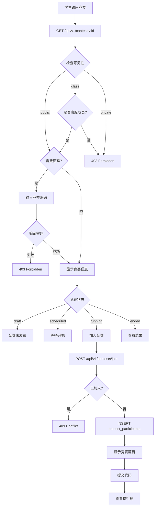
```mermaid
flowchart TD
    Start[学生访问竞赛] --> GetContest[GET /api/v1/contests/:id]
    GetContest --> CheckVisibility{检查可见性}
    
    CheckVisibility -->|public| CheckEncrypted{需要密码?}
    CheckVisibility -->|class| CheckClassMember{是否班级成员?}
    CheckVisibility -->|private| Forbidden[403 Forbidden]
    
    CheckClassMember -->|是| CheckEncrypted
    CheckClassMember -->|否| Forbidden
    
    CheckEncrypted -->|是| InputPassword[输入竞赛密码]
    CheckEncrypted -->|否| ShowContest[显示竞赛信息]
    
    InputPassword --> VerifyPassword{验证密码}
    VerifyPassword -->|失败| Return403[403 Forbidden]
    VerifyPassword -->|成功| ShowContest
    
    ShowContest --> CheckStatus{竞赛状态}
    CheckStatus -->|draft| NotPublished[竞赛未发布]
    CheckStatus -->|scheduled| Waiting[等待开始]
    CheckStatus -->|running| Join[加入竞赛]
    CheckStatus -->|ended| ViewResult[查看结果]
    
    Join --> JoinRequest[POST /api/v1/contests/join]
    JoinRequest --> CheckDuplicate{已加入?}
    CheckDuplicate -->|是| Return409[409 Conflict]
    CheckDuplicate -->|否| CreateParticipant[INSERT contest_participants]
    CreateParticipant --> ShowProblems[显示竞赛题目]
    ShowProblems --> SubmitCode[提交代码]
    SubmitCode --> Scoreboard[查看排行榜]
```

### 5.3 ACM排行榜计算流程

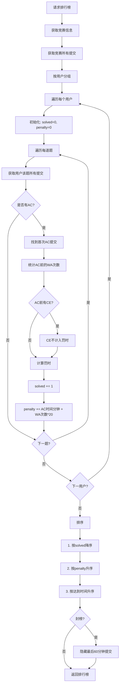
```mermaid
flowchart TD
    Start[请求排行榜] --> GetContest[获取竞赛信息]
    GetContest --> GetSubmissions[获取竞赛所有提交]
    GetSubmissions --> GroupByUser[按用户分组]
    
    GroupByUser --> LoopUsers[遍历每个用户]
    LoopUsers --> InitScore[初始化: solved=0, penalty=0]
    
    InitScore --> LoopProblems[遍历每道题]
    LoopProblems --> GetUserSubmits[获取用户该题所有提交]
    
    GetUserSubmits --> CheckAC{是否有AC?}
    CheckAC -->|否| NextProblem{下一题?}
    CheckAC -->|是| FindFirstAC[找到首次AC提交]
    
    FindFirstAC --> CountWA[统计AC前的WA次数]
    CountWA --> CheckCE{AC前有CE?}
    
    CheckCE -->|是| IgnoreCE[CE不计入罚时]
    CheckCE -->|否| CalcPenalty[计算罚时]
    
    IgnoreCE --> CalcPenalty
    CalcPenalty --> AddSolved[solved += 1]
    AddSolved --> AddPenalty[penalty += AC时间分钟 + WA次数*20]
    AddPenalty --> NextProblem
    
    NextProblem -->|是| LoopProblems
    NextProblem -->|否| NextUser{下一用户?}
    
    NextUser -->|是| LoopUsers
    NextUser -->|否| SortUsers[排序]
    
    SortUsers --> Sort1[1. 按solved降序]
    Sort1 --> Sort2[2. 按penalty升序]
    Sort2 --> Sort3[3. 按达到时间升序]
    Sort3 --> ApplyFreeze{封榜?}
    
    ApplyFreeze -->|是| HideLastHour[隐藏最后60分钟提交]
    ApplyFreeze -->|否| ReturnResult[返回排行榜]
    HideLastHour --> ReturnResult
```

---

## 6. 班级管理流程

### 6.1 教师创建班级流程

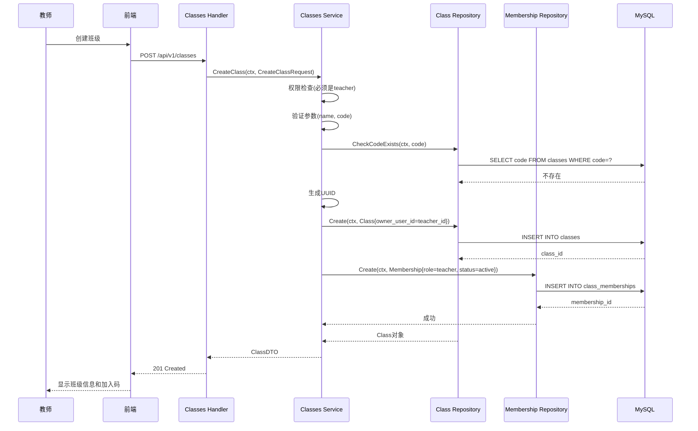
```mermaid
sequenceDiagram
    participant Teacher as 教师
    participant Frontend as 前端
    participant Handler as Classes Handler
    participant Service as Classes Service
    participant ClassRepo as Class Repository
    participant MembershipRepo as Membership Repository
    participant DB as MySQL
    
    Teacher->>Frontend: 创建班级
    Frontend->>Handler: POST /api/v1/classes
    Handler->>Service: CreateClass(ctx, CreateClassRequest)
    
    Service->>Service: 权限检查(必须是teacher)
    Service->>Service: 验证参数(name, code)
    Service->>ClassRepo: CheckCodeExists(ctx, code)
    ClassRepo->>DB: SELECT code FROM classes WHERE code=?
    DB-->>ClassRepo: 不存在
    
    Service->>Service: 生成UUID
    Service->>ClassRepo: Create(ctx, Class{owner_user_id=teacher_id})
    ClassRepo->>DB: INSERT INTO classes
    DB-->>ClassRepo: class_id
    
    Service->>MembershipRepo: Create(ctx, Membership{role=teacher, status=active})
    MembershipRepo->>DB: INSERT INTO class_memberships
    DB-->>MembershipRepo: membership_id
    
    MembershipRepo-->>Service: 成功
    ClassRepo-->>Service: Class对象
    Service-->>Handler: ClassDTO
    Handler-->>Frontend: 201 Created
    Frontend-->>Teacher: 显示班级信息和加入码
```

### 6.2 学生申请加入班级流程

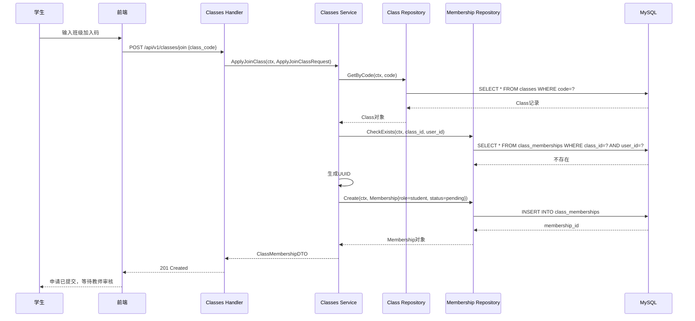
```mermaid
sequenceDiagram
    participant Student as 学生
    participant Frontend as 前端
    participant Handler as Classes Handler
    participant Service as Classes Service
    participant ClassRepo as Class Repository
    participant MembershipRepo as Membership Repository
    participant DB as MySQL
    
    Student->>Frontend: 输入班级加入码
    Frontend->>Handler: POST /api/v1/classes/join {class_code}
    Handler->>Service: ApplyJoinClass(ctx, ApplyJoinClassRequest)
    
    Service->>ClassRepo: GetByCode(ctx, code)
    ClassRepo->>DB: SELECT * FROM classes WHERE code=?
    DB-->>ClassRepo: Class记录
    ClassRepo-->>Service: Class对象
    
    Service->>MembershipRepo: CheckExists(ctx, class_id, user_id)
    MembershipRepo->>DB: SELECT * FROM class_memberships WHERE class_id=? AND user_id=?
    DB-->>MembershipRepo: 不存在
    
    Service->>Service: 生成UUID
    Service->>MembershipRepo: Create(ctx, Membership{role=student, status=pending})
    MembershipRepo->>DB: INSERT INTO class_memberships
    DB-->>MembershipRepo: membership_id
    
    MembershipRepo-->>Service: Membership对象
    Service-->>Handler: ClassMembershipDTO
    Handler-->>Frontend: 201 Created
    Frontend-->>Student: 申请已提交，等待教师审核
```

### 6.3 教师审核学生申请流程

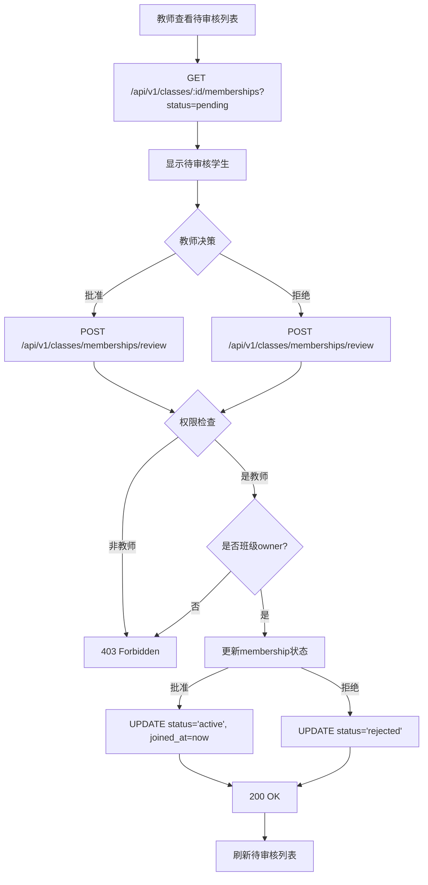
```mermaid
flowchart TD
    Start[教师查看待审核列表] --> GetPending[GET /api/v1/classes/:id/memberships?status=pending]
    GetPending --> ShowList[显示待审核学生]
    
    ShowList --> TeacherDecision{教师决策}
    
    TeacherDecision -->|批准| Approve[POST /api/v1/classes/memberships/review]
    TeacherDecision -->|拒绝| Reject[POST /api/v1/classes/memberships/review]
    
    Approve --> CheckAuth{权限检查}
    Reject --> CheckAuth
    
    CheckAuth -->|非教师| Forbidden[403 Forbidden]
    CheckAuth -->|是教师| CheckOwner{是否班级owner?}
    
    CheckOwner -->|否| Forbidden
    CheckOwner -->|是| UpdateStatus[更新membership状态]
    
    UpdateStatus -->|批准| SetActive[UPDATE status='active', joined_at=now]
    UpdateStatus -->|拒绝| SetRejected[UPDATE status='rejected']
    
    SetActive --> Success[200 OK]
    SetRejected --> Success
    
    Success --> RefreshList[刷新待审核列表]
```

### 6.4 班级成员状态机

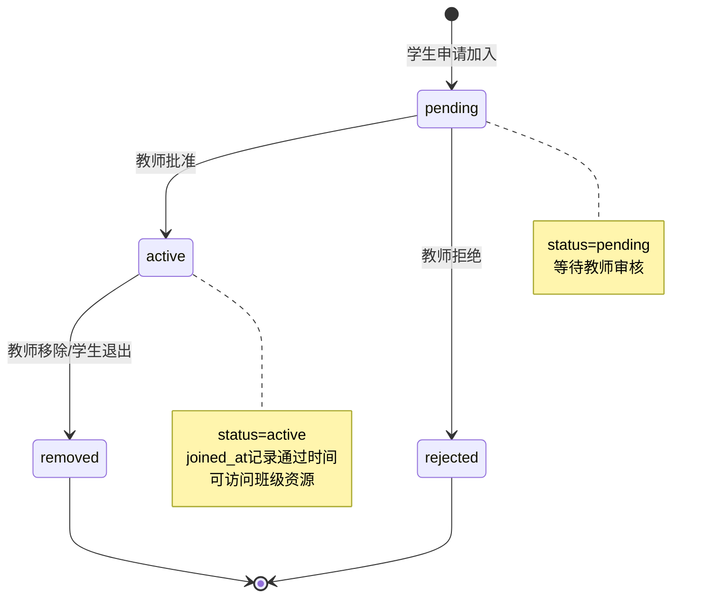
```mermaid
stateDiagram-v2
    [*] --> pending: 学生申请加入
    pending --> active: 教师批准
    pending --> rejected: 教师拒绝
    active --> removed: 教师移除/学生退出
    
    rejected --> [*]
    removed --> [*]
    
    note right of pending
        status=pending
        等待教师审核
    end note
    
    note right of active
        status=active
        joined_at记录通过时间
        可访问班级资源
    end note
```

---

## 7. 讨论区流程

### 7.1 发帖与评论流程

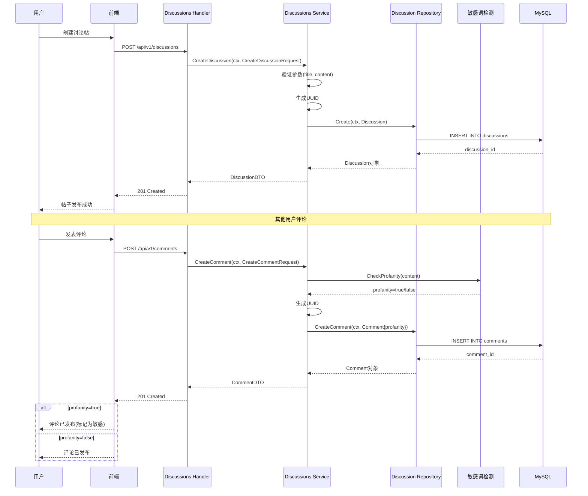
```mermaid
sequenceDiagram
    participant User as 用户
    participant Frontend as 前端
    participant Handler as Discussions Handler
    participant Service as Discussions Service
    participant Repo as Discussion Repository
    participant ProfanityDetector as 敏感词检测
    participant DB as MySQL
    
    User->>Frontend: 创建讨论帖
    Frontend->>Handler: POST /api/v1/discussions
    Handler->>Service: CreateDiscussion(ctx, CreateDiscussionRequest)
    
    Service->>Service: 验证参数(title, content)
    Service->>Service: 生成UUID
    Service->>Repo: Create(ctx, Discussion)
    Repo->>DB: INSERT INTO discussions
    DB-->>Repo: discussion_id
    Repo-->>Service: Discussion对象
    Service-->>Handler: DiscussionDTO
    Handler-->>Frontend: 201 Created
    Frontend-->>User: 帖子发布成功
    
    Note over User,DB: 其他用户评论
    User->>Frontend: 发表评论
    Frontend->>Handler: POST /api/v1/comments
    Handler->>Service: CreateComment(ctx, CreateCommentRequest)
    
    Service->>ProfanityDetector: CheckProfanity(content)
    ProfanityDetector-->>Service: profanity=true/false
    
    Service->>Service: 生成UUID
    Service->>Repo: CreateComment(ctx, Comment{profanity})
    Repo->>DB: INSERT INTO comments
    DB-->>Repo: comment_id
    Repo-->>Service: Comment对象
    Service-->>Handler: CommentDTO
    Handler-->>Frontend: 201 Created
    
    alt profanity=true
        Frontend-->>User: 评论已发布(标记为敏感)
    else profanity=false
        Frontend-->>User: 评论已发布
    end
```

---

## 8. 管理员流程

### 8.1 管理员创建教师账号流程

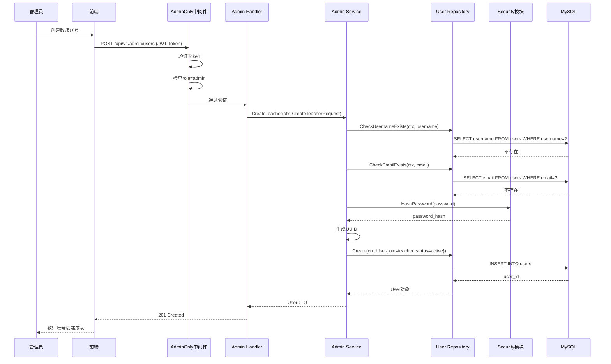
```mermaid
sequenceDiagram
    participant Admin as 管理员
    participant Frontend as 前端
    participant Middleware as AdminOnly中间件
    participant Handler as Admin Handler
    participant Service as Admin Service
    participant Repo as User Repository
    participant Security as Security模块
    participant DB as MySQL
    
    Admin->>Frontend: 创建教师账号
    Frontend->>Middleware: POST /api/v1/admin/users (JWT Token)
    Middleware->>Middleware: 验证Token
    Middleware->>Middleware: 检查role=admin
    Middleware->>Handler: 通过验证
    
    Handler->>Service: CreateTeacher(ctx, CreateTeacherRequest)
    Service->>Repo: CheckUsernameExists(ctx, username)
    Repo->>DB: SELECT username FROM users WHERE username=?
    DB-->>Repo: 不存在
    
    Service->>Repo: CheckEmailExists(ctx, email)
    Repo->>DB: SELECT email FROM users WHERE email=?
    DB-->>Repo: 不存在
    
    Service->>Security: HashPassword(password)
    Security-->>Service: password_hash
    
    Service->>Service: 生成UUID
    Service->>Repo: Create(ctx, User{role=teacher, status=active})
    Repo->>DB: INSERT INTO users
    DB-->>Repo: user_id
    
    Repo-->>Service: User对象
    Service-->>Handler: UserDTO
    Handler-->>Frontend: 201 Created
    Frontend-->>Admin: 教师账号创建成功
```

### 8.2 管理员用户管理流程

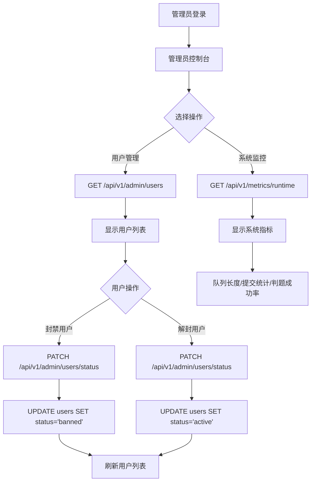
```mermaid
flowchart TD
    Start[管理员登录] --> Dashboard[管理员控制台]
    Dashboard --> SelectAction{选择操作}
    
    SelectAction -->|用户管理| UserMgmt[GET /api/v1/admin/users]
    SelectAction -->|系统监控| Monitoring[GET /api/v1/metrics/runtime]
    
    UserMgmt --> ListUsers[显示用户列表]
    ListUsers --> UserAction{用户操作}
    
    UserAction -->|封禁用户| BanUser[PATCH /api/v1/admin/users/status]
    UserAction -->|解封用户| UnbanUser[PATCH /api/v1/admin/users/status]
    
    BanUser --> UpdateDB[UPDATE users SET status='banned']
    UnbanUser --> UpdateDB2[UPDATE users SET status='active']
    
    UpdateDB --> RefreshList[刷新用户列表]
    UpdateDB2 --> RefreshList
    
    Monitoring --> ShowMetrics[显示系统指标]
    ShowMetrics --> MetricsDetail[队列长度/提交统计/判题成功率]
```

---

## 9. 数据模型关系图

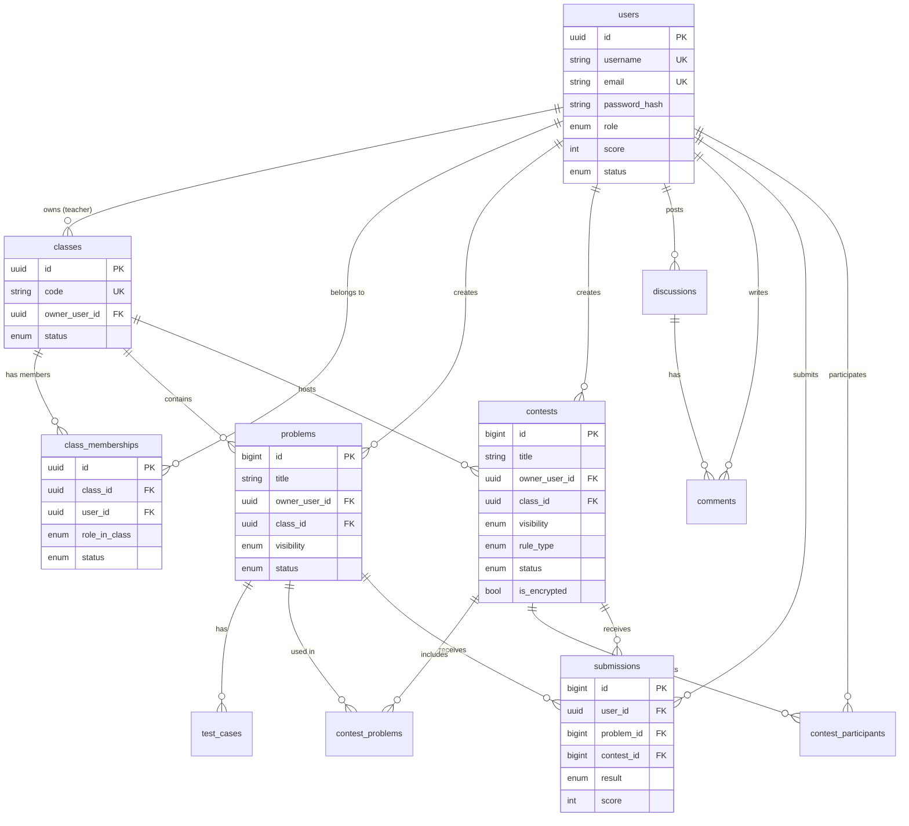
```mermaid
erDiagram
    users ||--o{ classes : "owns (teacher)"
    users ||--o{ class_memberships : "belongs to"
    users ||--o{ problems : "creates"
    users ||--o{ contests : "creates"
    users ||--o{ discussions : "posts"
    users ||--o{ comments : "writes"
    users ||--o{ submissions : "submits"
    users ||--o{ contest_participants : "participates"
    
    classes ||--o{ class_memberships : "has members"
    classes ||--o{ problems : "contains"
    classes ||--o{ contests : "hosts"
    
    problems ||--o{ test_cases : "has"
    problems ||--o{ contest_problems : "used in"
    problems ||--o{ submissions : "receives"
    
    contests ||--o{ contest_problems : "includes"
    contests ||--o{ contest_participants : "has participants"
    contests ||--o{ submissions : "receives"
    
    discussions ||--o{ comments : "has"
    
    users {
        uuid id PK
        string username UK
        string email UK
        string password_hash
        enum role
        int score
        enum status
    }
    
    classes {
        uuid id PK
        string code UK
        uuid owner_user_id FK
        enum status
    }
    
    class_memberships {
        uuid id PK
        uuid class_id FK
        uuid user_id FK
        enum role_in_class
        enum status
    }
    
    problems {
        bigint id PK
        string title
        uuid owner_user_id FK
        uuid class_id FK
        enum visibility
        enum status
    }
    
    contests {
        bigint id PK
        string title
        uuid owner_user_id FK
        uuid class_id FK
        enum visibility
        enum rule_type
        enum status
        bool is_encrypted
    }
    
    submissions {
        bigint id PK
        uuid user_id FK
        bigint problem_id FK
        bigint contest_id FK
        enum result
        int score
    }
```

---

## 10. 系统架构分层图（实际代码结构）

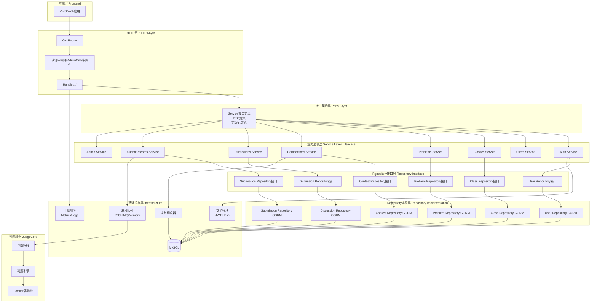
```mermaid
graph TB
    subgraph "前端层 Frontend"
        Web[Vue3 Web应用]
    end
    
    subgraph "HTTP层 HTTP Layer"
        Router[Gin Router]
        Middleware[认证中间件/AdminOnly中间件]
        Handler[Handler层]
    end
    
    subgraph "接口契约层 Ports Layer"
        Ports[Service接口定义<br/>DTO定义<br/>错误码定义]
    end
    
    subgraph "业务逻辑层 Service Layer (Usecase)"
        AuthService[Auth Service]
        UsersService[Users Service]
        ClassesService[Classes Service]
        ProblemsService[Problems Service]
        CompetitionsService[Competitions Service]
        DiscussionsService[Discussions Service]
        SubmitRecordsService[SubmitRecords Service]
        AdminService[Admin Service]
    end
    
    subgraph "Repository接口层 Repository Interface"
        AuthRepo[User Repository接口]
        ClassRepo[Class Repository接口]
        ProblemRepo[Problem Repository接口]
        ContestRepo[Contest Repository接口]
        DiscussRepo[Discussion Repository接口]
        SubmitRepo[Submission Repository接口]
    end
    
    subgraph "Repository实现层 Repository Implementation"
        AuthRepoImpl[User Repository GORM]
        ClassRepoImpl[Class Repository GORM]
        ProblemRepoImpl[Problem Repository GORM]
        ContestRepoImpl[Contest Repository GORM]
        DiscussRepoImpl[Discussion Repository GORM]
        SubmitRepoImpl[Submission Repository GORM]
    end
    
    subgraph "基础设施层 Infrastructure"
        DB[(MySQL)]
        Queue[消息队列<br/>RabbitMQ/Memory]
        Scheduler[定时调度器]
        Security[安全模块<br/>JWT/Hash]
        Observability[可观测性<br/>Metrics/Logs]
    end
    
    subgraph "判题服务 JudgeCore"
        JudgeAPI[判题API]
        JudgeEngine[判题引擎]
        DockerPool[Docker容器池]
    end
    
    Web --> Router
    Router --> Middleware
    Middleware --> Handler
    
    Handler --> Ports
    Ports --> AuthService
    Ports --> UsersService
    Ports --> ClassesService
    Ports --> ProblemsService
    Ports --> CompetitionsService
    Ports --> DiscussionsService
    Ports --> SubmitRecordsService
    Ports --> AdminService
    
    AuthService --> AuthRepo
    ClassesService --> ClassRepo
    ProblemsService --> ProblemRepo
    CompetitionsService --> ContestRepo
    DiscussionsService --> DiscussRepo
    SubmitRecordsService --> SubmitRepo
    
    AuthRepo --> AuthRepoImpl
    ClassRepo --> ClassRepoImpl
    ProblemRepo --> ProblemRepoImpl
    ContestRepo --> ContestRepoImpl
    DiscussRepo --> DiscussRepoImpl
    SubmitRepo --> SubmitRepoImpl
    
    AuthRepoImpl --> DB
    ClassRepoImpl --> DB
    ProblemRepoImpl --> DB
    ContestRepoImpl --> DB
    DiscussRepoImpl --> DB
    SubmitRepoImpl --> DB
    
    SubmitRecordsService --> Queue
    Queue --> JudgeAPI
    JudgeAPI --> JudgeEngine
    JudgeEngine --> DockerPool
    
    CompetitionsService --> Scheduler
    Scheduler --> DB
    
    AuthService --> Security
    Handler --> Observability
```

---

## 11. 权限控制流程

### 11.1 权限验证流程

```mermaid
flowchart TD
    Start[HTTP请求] --> ExtractToken[提取JWT Token]
    ExtractToken --> ValidateToken{Token有效?}
    
    ValidateToken -->|无效| Return401[401 Unauthorized]
    ValidateToken -->|有效| ParseClaims[解析Token Claims]
    
    ParseClaims --> GetUserInfo[获取userID和role]
    GetUserInfo --> InjectContext[注入到Gin Context]
    InjectContext --> CheckEndpoint{检查端点}
    
    CheckEndpoint -->|/api/v1/admin/*| CheckAdmin{role=admin?}
    CheckEndpoint -->|其他| NextHandler[调用Handler]
    
    CheckAdmin -->|否| Return403[403 Forbidden]
    CheckAdmin -->|是| NextHandler
    
    NextHandler --> BusinessLogic[业务逻辑]
    BusinessLogic --> CheckResource{检查资源权限}
    
    CheckResource -->|需要owner| CheckOwnership{是否owner?}
    CheckResource -->|需要班级成员| CheckMember{是否成员?}
    CheckResource -->|公共资源| AllowAccess[允许访问]
    
    CheckOwnership -->|否| Return403
    CheckOwnership -->|是| AllowAccess
    
    CheckMember -->|否| Return403
    CheckMember -->|是| AllowAccess
    
    AllowAccess --> Return200[200 OK]
```

---

## 12. 队列与异步处理流程

### 12.1 消息队列架构

```mermaid
graph TB
    subgraph "生产者 Producers"
        SubmitService[SubmitRecords Service]
    end
    
    subgraph "消息队列 Message Queue"
        QueueInterface[SubmissionQueue接口]
        RabbitMQ[RabbitMQ实现]
        MemoryQueue[内存队列实现]
        
        QueueInterface --> RabbitMQ
        QueueInterface --> MemoryQueue
    end
    
    subgraph "消费者 Consumers"
        Worker1[判题Worker-1]
        Worker2[判题Worker-2]
        WorkerN[判题Worker-N]
    end
    
    subgraph "判题服务 JudgeCore"
        JudgeAPI[判题API]
    end
    
    subgraph "回调 Callback"
        WritebackHandler[Writeback Handler]
        SubmitService2[SubmitRecords Service]
    end
    
    SubmitService -->|Enqueue| QueueInterface
    
    QueueInterface -->|Dequeue| Worker1
    QueueInterface -->|Dequeue| Worker2
    QueueInterface -->|Dequeue| WorkerN
    
    Worker1 -->|POST /judge| JudgeAPI
    Worker2 -->|POST /judge| JudgeAPI
    WorkerN -->|POST /judge| JudgeAPI
    
    JudgeAPI -->|判题结果| Worker1
    JudgeAPI -->|判题结果| Worker2
    JudgeAPI -->|判题结果| WorkerN
    
    Worker1 -->|POST /api/v1/judge/writeback| WritebackHandler
    Worker2 -->|POST /api/v1/judge/writeback| WritebackHandler
    WorkerN -->|POST /api/v1/judge/writeback| WritebackHandler
    
    WritebackHandler --> SubmitService2
    SubmitService2 -->|UPDATE| DB[(MySQL)]
```

### 12.2 判题Worker生命周期

```mermaid
stateDiagram-v2
    [*] --> Idle: Worker启动
    Idle --> Polling: 轮询队列
    Polling --> Idle: 队列为空
    Polling --> Processing: 获取任务
    
    Processing --> FetchSubmission: 获取提交详情
    FetchSubmission --> MarkJudging: 更新状态为judging
    MarkJudging --> CallJudgeCore: 调用JudgeCore
    
    CallJudgeCore --> WaitResult: 等待判题结果
    WaitResult --> Writeback: 收到结果
    
    Writeback --> CheckIdempotent: 幂等检查
    CheckIdempotent --> UpdateDB: 更新数据库
    UpdateDB --> Acknowledge: 确认消息
    
    Acknowledge --> Success: 处理成功
    Success --> Idle: 继续处理下一个
    
    note right of MarkJudging
        防止重复判题
    end note
    
    note right of CheckIdempotent
        终态不可回退
    end note
```

---

## 13. 定时调度流程

### 13.1 竞赛状态自动驱动

```mermaid
sequenceDiagram
    participant Scheduler as 定时调度器
    participant DB as MySQL
    participant Logger as 日志系统
    
    Note over Scheduler: 每分钟执行一次
    
    loop 每分钟
        Scheduler->>DB: SELECT * FROM contests WHERE status != 'draft'
        DB-->>Scheduler: 竞赛列表
        
        loop 遍历每个竞赛
            Scheduler->>Scheduler: 获取当前时间now
            Scheduler->>Scheduler: 读取start_at和end_at
            
            alt now < start_at
                Scheduler->>Scheduler: desired_status = 'scheduled'
            else start_at <= now < end_at
                Scheduler->>Scheduler: desired_status = 'running'
            else now >= end_at
                Scheduler->>Scheduler: desired_status = 'ended'
            end
            
            Scheduler->>DB: SELECT status FROM contests WHERE id=?
            DB-->>Scheduler: current_status
            
            alt current_status != desired_status
                Scheduler->>DB: UPDATE contests SET status=? WHERE id=? AND status!=?
                DB-->>Scheduler: 更新成功
                Scheduler->>Logger: 记录状态变更日志
            else current_status == desired_status
                Scheduler->>Scheduler: 无需更新，跳过
            end
        end
    end
```

---

## 14. 可观测性与监控

### 14.1 监控指标收集流程

```mermaid
graph TB
    subgraph "业务层 Business Layer"
        Handler[HTTP Handler]
        Service[Service]
        Worker[判题Worker]
    end
    
    subgraph "可观测性模块 Observability"
        Metrics[指标收集器]
        Logger[结构化日志]
        Counter[计数器]
        Timer[计时器]
    end
    
    subgraph "指标类型 Metrics Types"
        QueueLen[队列长度]
        SubmitCount[提交总数]
        JudgeSuccess[判题成功数]
        JudgeFail[判题失败数]
        APILatency[API延迟]
    end
    
    subgraph "日志类型 Log Types"
        AccessLog[访问日志]
        ErrorLog[错误日志]
        BusinessLog[业务日志]
    end
    
    Handler --> Metrics
    Service --> Metrics
    Worker --> Metrics
    
    Handler --> Logger
    Service --> Logger
    Worker --> Logger
    
    Metrics --> Counter
    Metrics --> Timer
    
    Counter --> QueueLen
    Counter --> SubmitCount
    Counter --> JudgeSuccess
    Counter --> JudgeFail
    
    Timer --> APILatency
    
    Logger --> AccessLog
    Logger --> ErrorLog
    Logger --> BusinessLog
    
    QueueLen --> Endpoint[GET /api/v1/metrics/runtime]
    SubmitCount --> Endpoint
    JudgeSuccess --> Endpoint
    JudgeFail --> Endpoint
    APILatency --> Endpoint
```

---

## 15. 总结

本文档基于实际代码结构绘制，准确反映了 FeasOJ backend-rebuild 的架构设计，包括：

**核心架构特点**：
- **分层架构**：Handler → Ports → Service → Repository接口 → Repository实现 → 数据库
- **依赖倒置**：Repository接口定义在usecase包内，实现在repository包内
- **接口契约**：Ports层定义所有Service接口和DTO，实现解耦
- **异步判题**：基于消息队列的异步判题架构，支持RabbitMQ和内存队列
- **状态驱动**：竞赛状态由定时调度器自动驱动，幂等收敛
- **可观测性**：结构化日志 + 运行时指标

**技术栈**：
- 框架：Gin
- ORM：GORM
- 数据库：MySQL
- 消息队列：RabbitMQ / Memory Queue
- 认证：JWT (2小时TTL)
- 判题：JudgeCore + Docker

**模块列表**：
- auth（认证）
- users（用户）
- classes（班级）
- problems（题目）
- competitions（竞赛，数据库表名为contests）
- discussions（讨论）
- submitrecords（提交记录）
- admin（管理员）

---

**文档版本**: v2.0 (修正版)  
**创建日期**: 2026-04-20  
**最后更新**: 2026-04-20  
**基于代码**: backend-rebuild实际代码结构

