# FeasOJ 当前进展与业务流程图

> 基于当前仓库实际实现整理，重点覆盖班级管理、竞赛管理，以及 ACM / OI 两种竞赛规则的业务闭环。

**更新时间**: 2026-04-21  
**代码基线**: `backend-rebuild` + `judgecore` + `web` 当前工作树  
**说明**: 本文档只描述当前代码已经实现或明确预留的流程，不把尚未落地的理想能力混写进流程图。

---

## 1. 当前项目进展

### 1.1 总体判断

当前项目已经从“后端接口骨架 + 前端占位”推进到“核心业务链路可用”的阶段，尤其是以下三条主线已经基本闭环：

1. 用户 / 题目 / 提交 / 判题主链路已经贯通到 `backend-rebuild` 和 `judgecore`。
2. 班级管理已经具备创建、申请加入、审核、列表展示的完整基本流程。
3. 竞赛已经具备创建、题目绑定、参赛、查看题目、提交、计分板聚合的主流程，且支持 `acm` 与 `oi` 两种规则。

### 1.2 已完成的核心能力

#### 后端 `backend-rebuild`

- 认证、用户资料、排行榜、讨论区、管理员用户治理均已实现路由与 usecase。
- 班级模块已实现：
  - 创建班级
  - 修改班级
  - 归档班级
  - 按班级码申请加入
  - 教师 / 助教 / 管理员审核成员
  - 查看我的班级成员关系
  - 查看指定班级成员关系
- 题目模块已实现：
  - 题目 CRUD
  - 可见性控制
  - testcase CRUD / reorder
- 竞赛模块已实现：
  - 竞赛 CRUD
  - 竞赛题目绑定
  - 参赛 / 退赛
  - 参赛者列表
  - 竞赛题目列表
  - 竞赛专属题目详情读取
  - ACM / OI 计分板聚合
- 判题链路已实现：
  - 提交记录创建
  - RabbitMQ / memory queue 两种模式
  - `judgecore` 消费新版 submission job
  - `judgecore` 通过 rebuild judge API 拉 problem bundle
  - `judgecore` 回写 `judging` 与 terminal result

#### 前端 `web`

- 班级页已切到 rebuild canonical API：
  - `Class/Main.vue`
  - `Class/Join.vue`
  - `Class/Members.vue`
- 竞赛页已具备：
  - 列表页参赛
  - 详情页查看公告 / 题目 / 参赛者
  - 教师 / 管理员的题目绑定管理页
- 题目页已具备：
  - 普通题目作答
  - 从竞赛上下文进入题目
  - 提交时携带 `contest_id`
  - testcase 管理入口与 testcase 管理页

### 1.3 当前仍应视为“未完全闭环”的点

- 尚未完成一次真实的本地全链路联机冒烟：
  - MySQL
  - RabbitMQ
  - backend-rebuild
  - judgecore
  - 前端
- 班级模块当前没有“学生主动退出班级”接口，也没有“教师移除成员”接口。
- 班级模块虽然识别 `assistant` 角色，但当前没有显式的“任命助教 / 调整班级内角色”API。
- 竞赛参与者状态中已经预留了 `finished`，但当前代码没有自动把参赛者切到 `finished`。
- OI 规则当前依赖 submission 的 `score` 聚合；如果后续需要更细粒度部分分回写，还要继续扩展 judge 结果结构。

### 1.4 当前可认为已经稳定的主闭环

```mermaid
flowchart LR
    A[教师创建题目] --> B[教师维护 Testcases]
    B --> C[教师创建竞赛]
    C --> D[教师绑定竞赛题目]
    D --> E[竞赛发布/调度]
    E --> F[学生参赛]
    F --> G[学生进入竞赛题目]
    G --> H[创建提交记录]
    H --> I[RabbitMQ / Memory Queue]
    I --> J[JudgeCore 拉取题目与 Testcases]
    J --> K[判题执行]
    K --> L[回写 judging/result]
    L --> M[计分板聚合 ACM/OI]
```

---

## 2. 班级管理业务流程

## 2.1 角色与对象

### 角色

- `admin`: 平台管理员
- `teacher`: 平台教师
- `assistant`: 班级内助教角色，当前只在审核权限判断中生效
- `student`: 普通学生

### 班级相关对象

- `classes`
  - 班级主体
  - 关键字段：`id`, `name`, `code`, `owner_user_id`, `status`
- `class_memberships`
  - 班级成员关系
  - 关键字段：`class_id`, `user_id`, `role_in_class`, `status`

### 当前实际状态

- 班级状态：
  - `active`
  - `archived`
- 班级成员状态：
  - `pending`
  - `active`
  - `rejected`

---

## 2.2 班级创建流程

### 业务说明

- 只有已登录教师 / 管理员前端才会显示创建班级入口。
- 创建班级成功后，系统会自动为创建者补一条 `active + teacher` 的 membership。

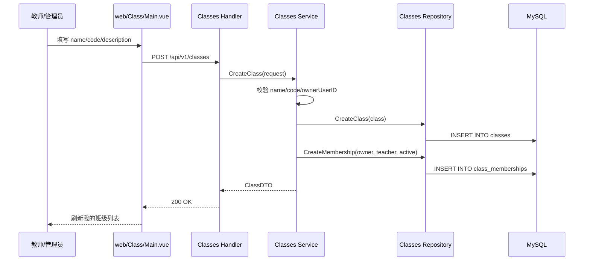

---

## 2.3 学生申请加入班级流程

### 业务说明

- 学生通过班级码申请加入。
- 如果班级已归档，申请会被拒绝。
- 如果该学生已经存在 membership 记录，会直接冲突，不允许重复申请。

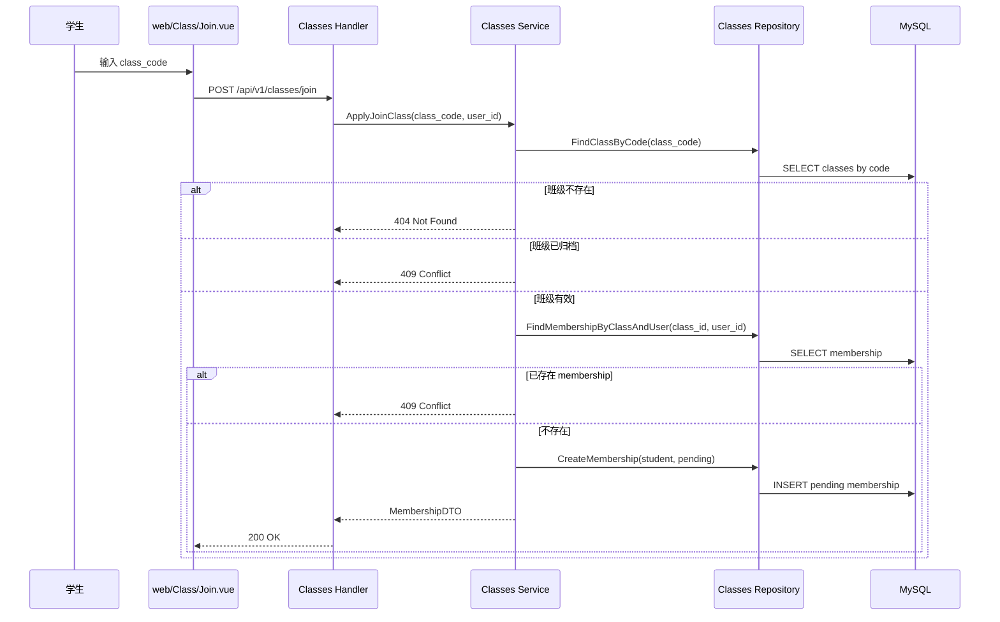

---

## 2.4 班级成员审核流程

### 业务说明

- 可审核者：
  - 班级 owner
  - 班级内 `assistant`
  - `admin`
- 只能审核 `pending` 状态。
- 审核通过后写入 `active`，同时补 `joined_at`。

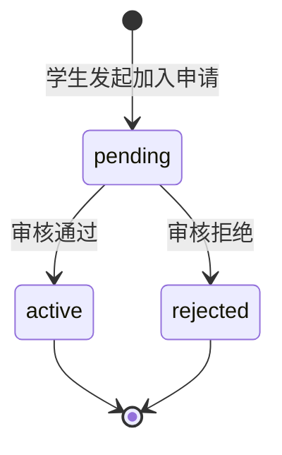

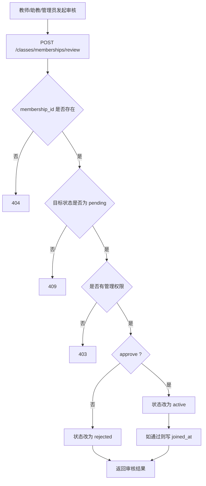

---

## 2.5 班级管理当前前后端职责分工

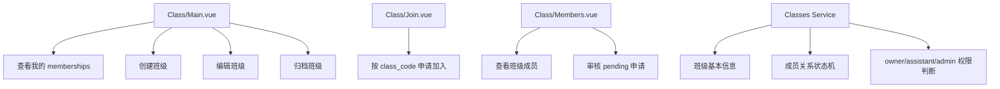

---

## 2.6 班级管理的当前限制

- 没有“退出班级”流程图，因为当前代码没有该接口。
- 没有“移除成员”流程图，因为当前代码没有该接口。
- 前端出现 `revoked` 文案，但后端当前实际审核状态只有 `pending / active / rejected`。

---

## 3. 竞赛管理业务流程

## 3.1 竞赛核心对象

### 竞赛主体 `contests`

关键字段：

- `visibility`
  - `public`
  - `class`
  - `private`
- `rule_type`
  - `acm`
  - `oi`
  - `assignment`（已预留，但本文重点不展开）
- `status`
  - `draft`
  - `scheduled`
  - `running`
  - `ended`
- `is_encrypted`
  - 是否需要密码进入

### 竞赛题目绑定 `contest_problems`

- `contest_id`
- `problem_id`
- `display_order`
- `alias`

### 参赛关系 `contest_participants`

- `status`
  - `registered`
  - `quit`
  - `finished`（已预留，当前未自动写入）

---

## 3.2 教师创建竞赛与绑定题目流程

### 业务说明

- 只有 `teacher/admin` 可以创建与修改竞赛。
- 竞赛在 `draft` 时允许还没有绑定题目。
- 当状态要切到非 `draft`，且可见性不是 `private` 时，后端会强制要求至少绑定 1 道题。

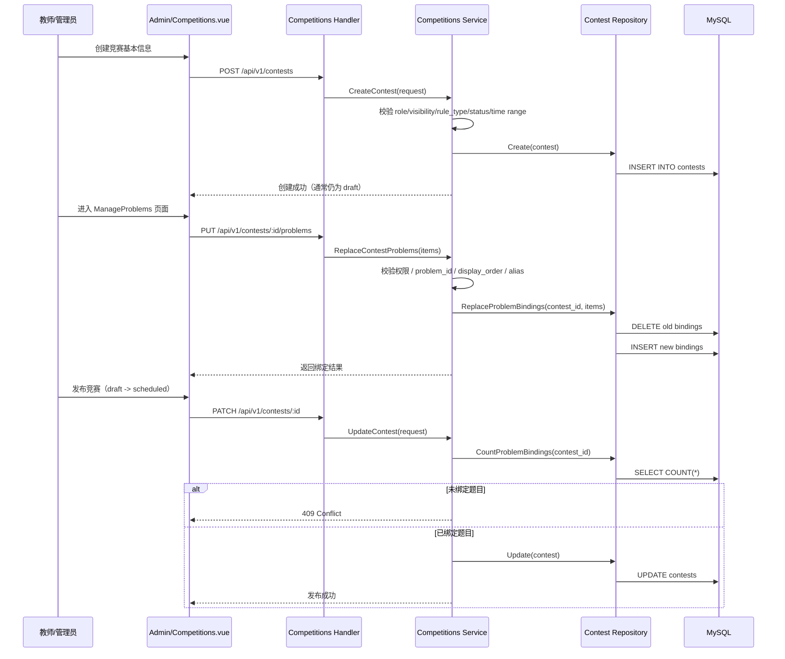

---

## 3.3 竞赛状态推进流程

### 业务说明

- 竞赛状态既可以由教师配置，也会被定时调度器根据 `start_at / end_at` 自动纠偏。
- `draft` 不会被自动推进。
- 非 `draft` 竞赛会按照时间窗口自动切到 `scheduled / running / ended`。

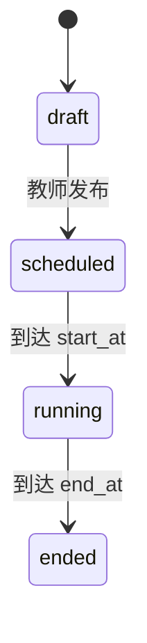

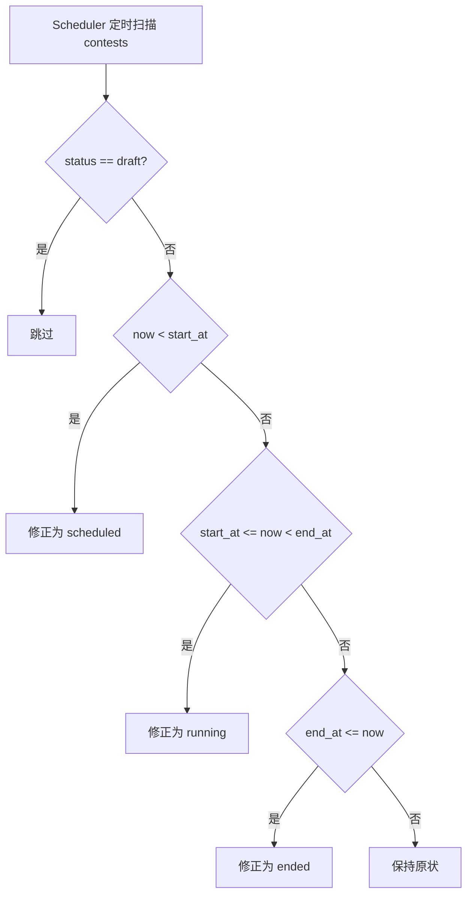

---

## 3.4 学生参赛流程

### 业务说明

- 学生从竞赛列表进入。
- 若竞赛加密，则必须输入密码。
- 成功后创建一条 `registered` 参赛记录。
- 已存在有效参赛记录会返回冲突。

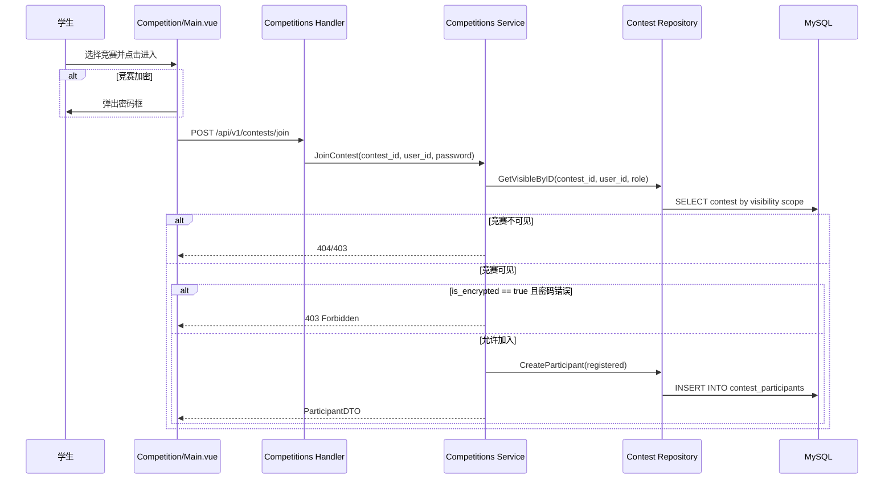

---

## 3.5 学生查看竞赛题目与做题流程

### 业务说明

- 竞赛题目列表不是公开任意可见。
- 能查看竞赛题目的对象：
  - `admin`
  - 竞赛 owner
  - 已加入且状态不是 `quit / finished` 的参赛者
- 当前前端已从竞赛详情页进入竞赛专属题目详情，并携带 `contest_id` 提交。

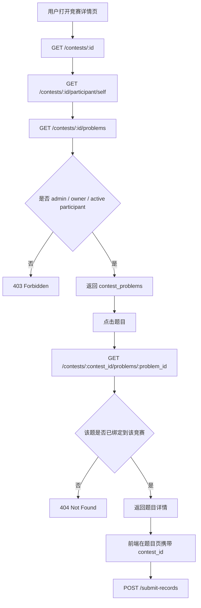

---

## 3.6 竞赛提交与判题流程

### 业务说明

- 题目页提交时会写入：
  - `problem_id`
  - `contest_id`
  - `language`
  - `source_code`
- rebuild 先持久化 submission，再入队。
- `judgecore` 消费 queue 中的 JSON contract，拉取 problem bundle，执行判题，再回写。

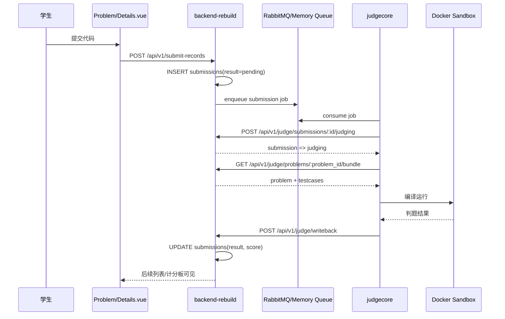

---

## 3.7 ACM 计分规则流程

### 当前代码规则

- 统计维度：每个用户、每道题。
- 首次 `accepted` 才视为解题成功。
- `compile_error` 和其他失败结果都会累计罚时尝试数。
- `pending / judging` 不参与计分。
- 总排名依据：
  1. 解题数 `solved` 降序
  2. 罚时 `penalty` 升序
  3. 最后达成时间 `reached_at` 升序

### 罚时组成

- 每题在首次 AC 前：
  - `wrongAttempts + ceAttempts`
  - 每次失败罚 `20` 分钟
- 再加上：
  - 该题 AC 时刻距离竞赛开始时间的分钟数

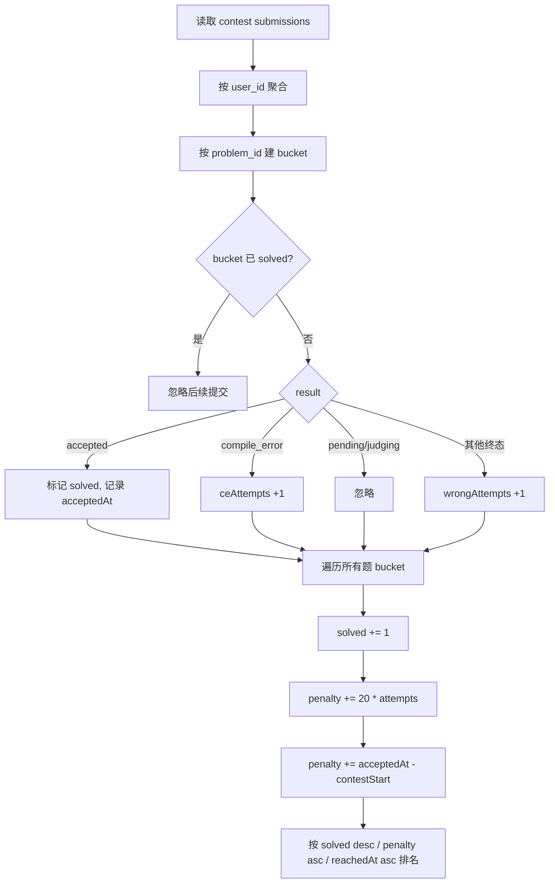

---

## 3.8 OI 计分规则流程

### 当前代码规则

- 统计维度：每个用户、每道题。
- 对同一题只保留历史最好分 `bestScore`。
- 若分数相同，则保留更早达到该分数的时间。
- `pending / judging` 不参与聚合。
- 总排名依据：
  1. `total_score` 降序
  2. `reached_at` 升序

### 注意

- 当前 OI 规则依赖 submission 的 `score` 字段。
- 若 judge 只回写 `accepted=100 / 非 accepted=0`，则表现为“整题得分”的 OI。
- 若后续 judge 支持部分分，则本规则天然兼容。

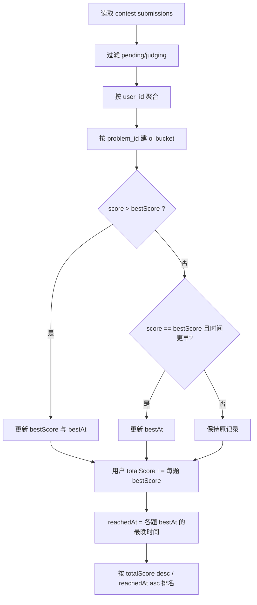

---

## 3.9 ACM 与 OI 的当前差异总结

| 维度 | ACM | OI |
| --- | --- | --- |
| 计分核心 | 解题数 + 罚时 | 总分 |
| 同题多次提交 | 只认首次 AC | 取历史最高分 |
| Compile Error | 计入罚时 | 只影响该次分数 |
| Wrong Answer | 计入罚时 | 只影响该次分数 |
| Pending/Judging | 忽略 | 忽略 |
| 排名优先级 | solved desc, penalty asc | total_score desc |
| 同分打破 | reachedAt 更早 | reachedAt 更早 |

---

## 3.10 冻结榜单流程

### 当前代码规则

- 冻结窗口固定为竞赛结束前 `60` 分钟。
- 在冻结窗口内：
  - 计分板只聚合到 `freezeStart`
  - `freeze_active = true`
- 竞赛结束后：
  - 恢复完整数据统计到 `end_at`

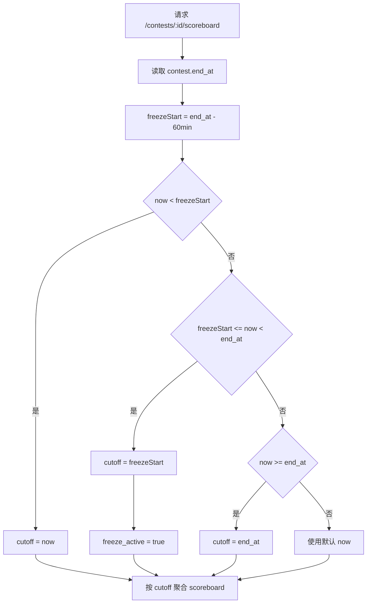

---

## 4. 结论

### 4.1 班级管理当前结论

- 班级主流程已经清晰可用：
  - 创建
  - 申请加入
  - 审核
  - 查看
- 但仍属于“基础班级治理”阶段，成员移除、退出、角色调整还未继续扩展。

### 4.2 竞赛当前结论

- 竞赛主闭环已经形成：
  - 创建竞赛
  - 绑定题目
  - 发布
  - 学生参赛
  - 查看题目
  - 提交判题
  - 生成 ACM / OI 计分板
- phase7 已把之前最关键的断点补上：
  - 竞赛题目绑定前端
  - 竞赛专属题目详情
  - testcase 前端管理
  - judgecore 与 rebuild 的判题合同对齐

### 4.3 还需要继续补的现实事项

- 做一次真实环境的端到端联调与验收记录。
- 继续补班级退出 / 移除 / 任命助教。
- 继续补更完整的 OI 部分分与题面/结果展示。
- 补运维文档，把 RabbitMQ、judge token、judgecore 启动配置写成 runbook。
